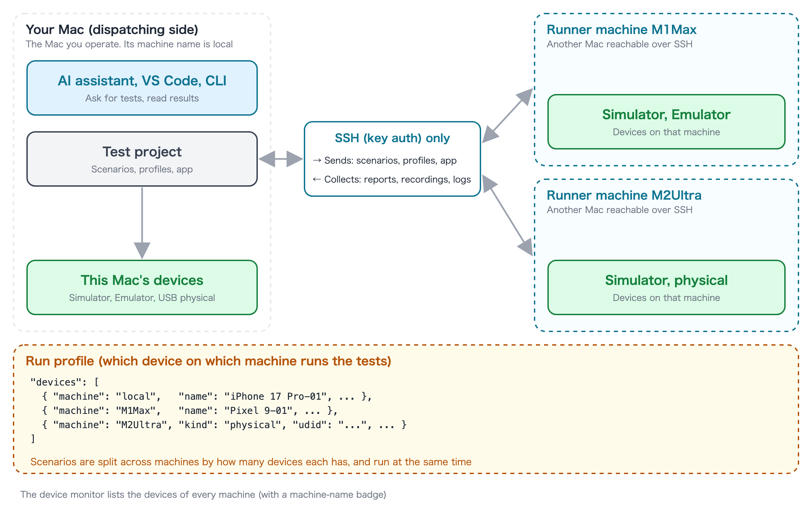

# Fleet concepts

[in Japanese(日本語)](concepts_ja.md)

In fleetest, the set of devices (virtual devices and physical devices) that run your tests is called a **fleet**.
You can grow your fleet by adding devices on local and remote Macs.

## The pieces

| Name | Description |
|---|---|
| Your Mac | The Mac you operate. You ask for tests from an AI assistant, VS Code or the CLI, and read the results here. Its machine name is `local` |
| Runner machine | Another Mac that runs tests for you. It does not need to be on the same LAN, as long as your Mac can log in to it over SSH |
| Machine name | A name you give a runner machine on your Mac (for example `M1Max`). Profiles use this name, not a host name or IP address |
| Device | Where the tests run: Simulators and Emulators (virtual devices) and physical devices (a real iPhone or Android). Every device belongs to one machine |
| Run profile | The setting that decides which devices on which machines run the tests. Each device has its machine name in `machine` |

## The run profile decides where tests run

The devices listed in a run profile's `devices` are where the run goes. Because each device has a `machine`,
**choosing a run profile also chooses which Macs run the tests**.

- If every device is on one runner machine, the run is sent to that runner machine.
- If the devices are split between your Mac and runner machines (or several runner machines), scenarios are split
  across machines by how many devices each has, and run at the same time.
- Physical devices work the same way. List a device with `"kind": "physical"` and its identifier, with the `machine`
  of the Mac it is connected to.

To run the same scenarios on every machine, create a **fleet definition** that lists pairs of a machine and a run
profile (`TestProjects/<project>/profiles/fleets/<name>.json`) and run `fleetest run --fleet <name>` (`--split`
splits the scenarios across the machines instead of running all of them everywhere; see [Remote Runners](remote_runners.md)).

## What happens automatically

- **Sending**: scenarios, profiles and the app are sent from your Mac to the runner machines on every run. You edit
  only on your Mac and never touch the files on a runner machine.
- **Collecting**: reports, JUnit, recordings and logs are collected back to your Mac and included in `fleetest results`
  (flaky detection and so on).
- **Watching**: the device monitor in the VS Code extension lists the devices of every machine just like your own
  (with a machine-name badge).
- **Keeping versions aligned**: before a run, fleetest checks that the runner machine has the same fleetest version as
  your Mac. If they differ, the run does not start.

The only connection is **SSH (key authentication) from your Mac to the runner machines**. Your Mac never needs to
accept incoming connections.

## How to grow it

| What you want | What to add | How |
|---|---|---|
| Run more devices at once so the whole suite finishes sooner | A Mac | [Adding a Mac](adding_mac.md) |
| Share one large Mac across a team | A Mac | Set it up in [Adding a Mac](adding_mac.md); how to use it is in "Sharing one runner between several people" in [Remote Runners](remote_runners.md) |
| Check on real hardware | Physical devices | [Adding physical devices](adding_physical_devices.md) |
| Connect physical devices to another Mac and run them there | A Mac and physical devices | Add the Mac first, then connect the devices to it |

How many Simulators and Emulators one Mac can run at once depends on its memory and CPU. When adding devices to
one Mac starts to slow things down, it is time to add a Mac.

## Good to know

- **A runner machine runs only one run at a time.** While someone is using it, other runs wait until it is free
  ("Sharing one runner between several people" in [Remote Runners](remote_runners.md)).
- **Keep a user logged in on each runner machine.** A Mac sitting at the login window cannot run tests.
- **You can take a machine out temporarily.** Clear "Machine enabled" under "Machines" in the device monitor's
  Settings tab, and no tests are sent to that machine.

## Related

- [Adding a Mac](adding_mac.md) — preparing a runner machine and adding it to the fleet
- [Adding physical devices](adding_physical_devices.md) — adding a real iPhone or Android to the fleet
- [Remote Runners](remote_runners.md) — `--runner`, `--fleet`, setups across a router, sharing, maintenance and safety

### Link
- [index](../index.md)
