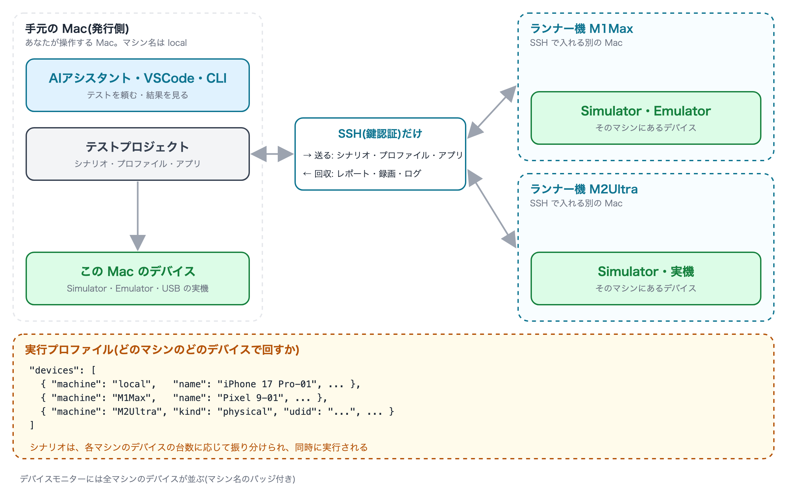

# フリートの考え方

[in English](concepts.md)

fleetest では、テストを実行するデバイス(仮想デバイス、実機)の集まりを**フリート**と呼びます。ローカルおよびリモートの Mac の
デバイスを追加することで、フリートを増強することができます。

## 登場するもの

| 名前 | 説明 |
|---|---|
| 手元の Mac | あなたが操作する Mac です。AIアシスタント・VSCode・CLI からテストを頼み、結果もここで見ます。マシン名は `local` です |
| ランナー機 | テストを実行させる別の Mac です。手元の Mac から SSH でログインできれば、同じ LAN になくても構いません |
| マシン名 | ランナー機に手元で付ける名前(例: `M1Max`)です。プロファイルにはホスト名や IP アドレスではなく、この名前を書きます |
| デバイス | テストを動かす端末です。Simulator・Emulator(仮想デバイス)と、実機(本物の iPhone / Android)があります。どれも、どれかのマシンに属します |
| 実行プロファイル | どのマシンのどのデバイスでテストを回すかを決める設定です。デバイスごとに `machine` にマシン名を書きます |

## どこで実行されるかは実行プロファイルで決まる

実行プロファイルの `devices` に並んだデバイスが、そのまま実行先になります。デバイスごとに `machine` を書くので、
**実行プロファイルを選べば、どの Mac で実行するかも決まります**。

- デバイスが全部1台のランナー機に載っていれば、run はそのランナー機へ送られます。
- 手元とランナー機(あるいは複数のランナー機)に分かれていれば、シナリオはマシンごとのデバイスの台数に応じて振り分けられ、
  同時に実行されます。
- 実機も同じです。`"kind": "physical"` と端末の識別子を書いたデバイスを、つないだ Mac の `machine` で並べます。

全マシンで同じシナリオを流したいときは、マシンと実行プロファイルの組を並べた**フリート定義**
(`TestProjects/<プロジェクト>/profiles/fleets/<名前>.json`)を作り、`fleetest run --fleet <名前>` で実行します
(`--split` を付けると、同じシナリオを全マシンで回す代わりに振り分けます。[リモート実行](remote_runners_ja.md))。

## 自動で行われること

- **送る**: シナリオ・プロファイル・アプリは、実行のたびに手元からランナー機へ送られます。編集は手元だけで行い、
  ランナー機のファイルを直接触ることはありません。
- **回収する**: レポート・JUnit・録画・ログは手元へ回収され、`fleetest results` の集計(flaky の検出など)にも入ります。
- **見る**: VSCode 拡張のデバイスモニターには、全マシンのデバイスが手元のものと同じように並びます(マシン名のバッジ付き)。
- **版を揃える**: 実行の前に、ランナー機の fleetest が手元と同じ版かを確かめます。ずれていれば実行は始まりません。

ランナー機との通信は、手元からランナー機への **SSH(鍵認証)だけ**です。手元の Mac が外から接続を受ける必要はありません。

## どう広げるか

| やりたいこと | 足すもの | 手順 |
|---|---|---|
| 同時に回す台数を増やして、テスト全体を速く終わらせたい | Mac | [Mac を追加する](adding_mac_ja.md) |
| チームで1台の大きな Mac を共有したい | Mac | [Mac を追加する](adding_mac_ja.md)の「1台のランナー機を複数人で使うとき」 |
| 本物の端末で確かめたい | 実機 | [実機を追加する](adding_physical_devices_ja.md) |
| 実機を別の Mac につないで、そちらで回したい | Mac と実機 | Mac を追加してから、その Mac に実機をつなぐ |

同時に動かせる Simulator・Emulator の台数は、その Mac のメモリと CPU で決まります。1台の Mac で台数を増やして
遅くなってきたら、Mac を足す頃合いです。

## 知っておくこと

- **1台のランナー機で同時に動く run は1つだけ**です。誰かが使っている間は、空くまで待ちます
  ([リモート実行](remote_runners_ja.md)の「1台のランナー機を複数人で使うとき」)。
- **ランナー機にはログインしたままにしておきます**。ログイン画面で止まっている Mac ではテストを動かせません。
- **マシンを一時的に外せます**。デバイスモニターの「設定」タブの「マシン」で「マシン有効」を外すと、そのマシンへは
  テストを振り分けません。

## 関連

- [Mac を追加する](adding_mac_ja.md) —— ランナー機を用意して、フリートに入れる手順
- [実機を追加する](adding_physical_devices_ja.md) —— 本物の iPhone / Android をフリートに入れる手順
- [リモート実行](remote_runners_ja.md) —— `--runner`・`--fleet`・ルーター越しの構成・複数人での共有・保守・安全

### Link
- [index](../index_ja.md)
