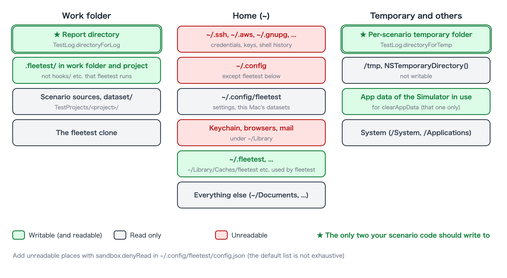
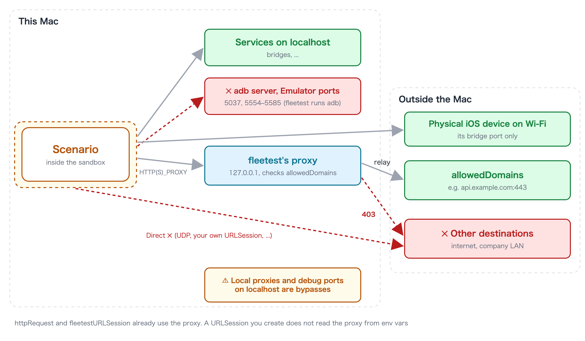

# Accessible folders and destinations

[in Japanese(日本語)](access_ja.md)

This page summarizes which folders a scenario inside the sandbox can read and write, and where it can connect.
For how the sandbox works, see [The sandbox](sandbox.md).



## Writable folders

**When your scenario code writes files, use only these two.**

| Folder | Description |
|---|---|
| [`TestLog.directoryForLog`](../reference/commands/test_log.md) | The output folder of this test class. Kept together with the report |
| [`TestLog.directoryForTemp`](../reference/commands/test_log.md) | A temporary folder for this scenario only. Deleted when the scenario ends |

There are other places that are writable because fleetest itself uses them (they are not for your scenario code).

| Place | Used for |
|---|---|
| The report directory | Results, screenshots, logs |
| `.fleetest/` in the project and the work folder, `~/.fleetest/` | fleetest's state. Things fleetest itself reads and runs or distributes in the next run or when preparing devices (`hooks/`, built runners, bridge ledgers, ...) are not writable |
| `~/Library/Logs/fleetest`, `~/Library/Caches/fleetest` | Logs, serializing Apple Intelligence calls |
| `~/Library/Caches/<scenario binary name>`, `~/Library/HTTPStorages/<scenario binary name>` | Model cache for image matching, the default store of `URLSession` |
| App data of the Simulator the scenario is using | So that `clearAppData` can delete data (other Simulators' data is not writable) |

**Examples of places you cannot write**: the scenario sources and other project files, the fleetest clone, the rest
of your home folder, `/tmp`, and the location returned by `NSTemporaryDirectory()` or
`FileManager.default.temporaryDirectory` (writing fails with "You don’t have permission").

## Readable folders

**Reading is allowed except for the list below** (the project, datasets, fleetest itself and so on are readable).
What is unreadable by default is the usual places for credentials and personal data.

| Kind | Unreadable places (relative to home) |
|---|---|
| Credentials and keys | `.ssh`, `.aws`, `.azure`, `.gnupg`, `.kube`, `.docker`, `.config` (but `.config/fleetest` is readable), `.netrc`, `.git-credentials`, `.npmrc`, `.pypirc`, `.pgpass`, `.vault-token`, `.terraform.d` |
| AI assistant settings | `.claude`, `.claude.json`, `.codex` |
| Build and distribution credentials | `.gradle`, `.m2`, `.gem/credentials`, `.cargo/credentials` (and `.toml`), `.pub-cache/credentials.json`, `.yarnrc`, `.yarnrc.yml`, `.bundle/config`, `.appstoreconnect`, `private_keys`, `.private_keys`, `.fastlane`, `.expo` |
| Android keys | `.android` (adb keys), `.emulator_console_auth_token` |
| Keychain and app data | `Library/Keychains`, `Library/Cookies`, `Library/Safari`, `Library/Mail`, `Library/Messages`, the profiles of Chrome, Firefox, Edge, Brave and Arc, app data of VSCode, Cursor, Slack and Claude |
| Shell history | `.zsh_history`, `.zsh_sessions`, `.bash_history`, `.bash_sessions`, `.python_history`, `.node_repl_history`, `.psql_history`, `.mysql_history` |

- **This list is not exhaustive.** If you keep secrets somewhere not listed, add it to `sandbox.denyRead` in the
  settings (it is **added** to the default list; it does not replace it).
- `~/.config/fleetest` is readable because `account()`, `data()` and `dataFile()` read the values for this Mac only
  (`~/.config/fleetest/dataset/`). It cannot be written.

## Environment variables

Only the environment variables fleetest uses are passed to scenarios (`PATH`, `HOME`, `USER`, `LANG`,
`DEVELOPER_DIR`, `JAVA_HOME`, `ANDROID_HOME` and so on, plus those starting with `FT_` / `LC_`). Tokens set in your
shell or in the `env` of `.mcp.json` are not visible. Put secrets a scenario needs in this Mac's file for
[`account()`](../reference/commands/dataset.md).

## Destinations



| Destination | Reachable? |
|---|---|
| This Mac's localhost (bridges and so on) | Yes. Only the adb server (5037 by default) and the Emulator ports (5554–5585) are closed |
| The bridge of a physical iOS device connected over Wi-Fi | Only that bridge's port |
| Destinations listed in `sandbox.allowedDomains` | Yes, through fleetest's proxy |
| Anything else (the internet, the company LAN) | No |

To allow an external destination, write it in `~/.config/fleetest/config.json` on the Mac that runs the scenario.

```json
{
  "sandbox": {
    "allowedDomains": ["api.example.com:443", "*.example.org"]
  }
}
```

- `*.example.org` matches subdomains only; it does not include `example.org` itself.
- **A line without a port lets every port of that host through.** If you know the port, write it.
- Connections that do not go through the proxy cannot reach even allowed destinations. `httpRequest` and
  `fleetestURLSession` already use the proxy. A `URLSession` you create yourself does not read the proxy from
  environment variables, so it cannot connect as is.

The full syntax, how to connect and how to read failures are in
[Network access from scenarios](../reference/writing/network_access.md).

## Firewall settings

### The sandbox is what narrows a scenario's outbound traffic

The macOS firewall (System Settings → Network → Firewall) stops **incoming** connections per app; it cannot narrow
traffic a scenario sends out. What allows a scenario's outbound traffic per destination is `sandbox.allowedDomains`
above. **If you write nothing, a scenario cannot reach the outside at all**, so you do not need an extra firewall.

- The actual connection to an allowed destination is made by fleetest itself (this Mac). The restrictions of the Mac's
  and your company network's firewalls and proxies still apply. If the destination is allowed but unreachable from
  the Mac, the proxy returns `502 Bad Gateway`.
- If **a local proxy runs on this Mac's localhost** (a traffic analysis tool, a corporate proxy agent, SSH port
  forwarding), a scenario can go through it to destinations outside `allowedDomains`. Stop it on Macs that run
  untrusted scenarios ([Notes and limitations](limitations.md)).

### Keep the macOS firewall on

- **fleetest opens no externally reachable port on this Mac.** The CLI, the MCP server and the monitor talk over
  standard input/output, and the bridges and the proxy listen only on loopback (`127.0.0.1`). Loopback is outside the
  firewall's scope, so fleetest works with the firewall on and without adding per-app permissions.
- When you use a physical iOS device over Wi-Fi, the device listens and the Mac connects to it. No setting is needed
  on the Mac.
- **Only on a Mac you use as a remote runner**, turn off the firewall's "Block all incoming connections" (when it is
  on, SSH is blocked too; the firewall itself can stay on). The steps are in
  [Adding a Mac](../fleet/adding_mac.md).

### Company firewalls

While tests run, fleetest itself does not go outside (except for scenarios connecting to `allowedDomains`). It goes
outside only for installation and updates; the destinations and how to run in a closed network are in
[Network exposure and security](network_security.md).

## Settings file summary

Settings go in `~/.config/fleetest/config.json` on the Mac that runs the scenario.

```json
{
  "sandbox": {
    "allowedDomains": ["api.example.com:443"],
    "denyRead": ["~/work/secrets"],
    "allowDirectAdb": false,
    "disabled": false
  },
  "redactAccountValues": true
}
```

| Key | Description |
|---|---|
| `sandbox.allowedDomains` | External destinations scenarios may reach. If omitted, scenarios cannot reach the outside at all |
| `sandbox.denyRead` | Places added to the default unreadable list (`~` is accepted) |
| `sandbox.allowDirectAdb` | When `true`, scenarios can use adb and bundletool themselves. In exchange they can reach the outside through the shell inside an Emulator and reach every connected Android device. Do not use it unless you need it |
| `sandbox.disabled` | When `true`, the sandbox is removed on this Mac |
| `redactAccountValues` | When `true`, values from `account()` are replaced with `***` in reports, run logs and results JSON (not redacted by default; [Test data and accounts](../reference/commands/dataset.md)) |

- An unknown key or broken JSON stops with an error before the scenario starts (so that a restriction you added is
  never silently dropped).
- Settings take effect from the next scenario launch.

### Link
- [index](../index.md)
