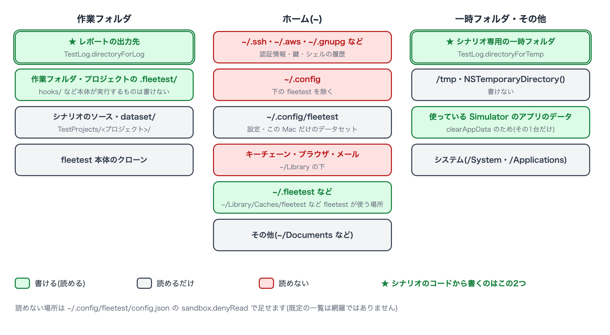
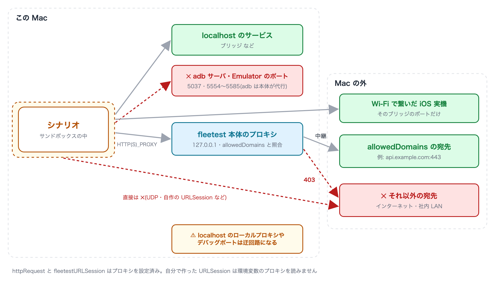

# アクセスできるフォルダと通信先

[in English](access.md)

サンドボックスの中のシナリオが、どのフォルダを読み書きでき、どこへ通信できるかをまとめます。
仕組みは[サンドボックスの考え方](sandbox_ja.md)を見てください。



## 書けるフォルダ

**シナリオのコードから書くときは、次の2つだけを使ってください。**

| フォルダ | 説明 |
|---|---|
| [`TestLog.directoryForLog`](../reference/commands/test_log_ja.md) | このテストクラスの出力フォルダ。レポートと一緒に残ります |
| [`TestLog.directoryForTemp`](../reference/commands/test_log_ja.md) | このシナリオ専用の一時フォルダ。シナリオが終わると消えます |

このほかに、fleetest 自身が使うために書ける場所があります(シナリオのコードから使う場所ではありません)。

| 場所 | 用途 |
|---|---|
| レポートの出力先 | 結果・スクリーンショット・ログ |
| プロジェクトと作業フォルダの `.fleetest/`、`~/.fleetest/` | fleetest の状態の記録。ただし、次の run やデバイスの用意で fleetest 本体が読んで実行・配布するもの(`hooks/`・ビルド済みのランナー・ブリッジの台帳など)は書けません |
| `~/Library/Logs/fleetest`・`~/Library/Caches/fleetest` | ログ、Apple Intelligence の呼び出しの直列化 |
| `~/Library/Caches/<シナリオ実行バイナリ名>`・`~/Library/HTTPStorages/<シナリオ実行バイナリ名>` | 画像照合のモデルのキャッシュ、`URLSession` の既定の保存先 |
| シナリオが使っている Simulator のアプリのデータ | `clearAppData` がデータを消すため(他の Simulator のものは書けません) |

**書けない場所の例**: シナリオのソースとプロジェクトの他のファイル、fleetest 本体のクローン、ホームの他の場所、
`/tmp`、`NSTemporaryDirectory()` や `FileManager.default.temporaryDirectory` が返す場所
(書くと「You don’t have permission」で失敗します)。

## 読めるフォルダ

**読み取りは、次の一覧を除いて許されています**(プロジェクト・データセット・fleetest 本体などは読めます)。
既定で読めないのは、認証情報と個人データの定番の置き場です。

| 種類 | 読めない場所(ホームからの相対) |
|---|---|
| 認証情報・鍵 | `.ssh`・`.aws`・`.azure`・`.gnupg`・`.kube`・`.docker`・`.config`(ただし `.config/fleetest` は読めます)・`.netrc`・`.git-credentials`・`.npmrc`・`.pypirc`・`.pgpass`・`.vault-token`・`.terraform.d` |
| AIアシスタントの設定 | `.claude`・`.claude.json`・`.codex` |
| ビルド・配布の資格情報 | `.gradle`・`.m2`・`.gem/credentials`・`.cargo/credentials`(`.toml` も)・`.pub-cache/credentials.json`・`.yarnrc`・`.yarnrc.yml`・`.bundle/config`・`.appstoreconnect`・`private_keys`・`.private_keys`・`.fastlane`・`.expo` |
| Android の鍵 | `.android`(adb の鍵)・`.emulator_console_auth_token` |
| キーチェーン・アプリのデータ | `Library/Keychains`・`Library/Cookies`・`Library/Safari`・`Library/Mail`・`Library/Messages`、Chrome・Firefox・Edge・Brave・Arc のプロファイル、VSCode・Cursor・Slack・Claude のアプリのデータ |
| シェルの履歴 | `.zsh_history`・`.zsh_sessions`・`.bash_history`・`.bash_sessions`・`.python_history`・`.node_repl_history`・`.psql_history`・`.mysql_history` |

- **この一覧は網羅ではありません**。ここに無い場所に秘密を置いているなら、設定の `sandbox.denyRead` に足してください
  (既定の一覧に**足す**形で、置き換えはしません)。
- `~/.config/fleetest` が読めるのは、`account()` / `data()` / `dataFile()` がこの Mac だけの値
  (`~/.config/fleetest/dataset/`)を読むためです。書くことはできません。

## 環境変数

シナリオに渡る環境変数は、fleetest が使うものだけです(`PATH`・`HOME`・`USER`・`LANG`・`DEVELOPER_DIR`・`JAVA_HOME`・
`ANDROID_HOME` などと、`FT_` / `LC_` で始まるもの)。シェルや `.mcp.json` の `env` に置いたトークンは見えません。
シナリオで使う秘密は [`account()`](../reference/commands/dataset_ja.md) のこの Mac 側のファイルに置きます。

## 通信先



| 宛先 | 可否 |
|---|---|
| この Mac の localhost(ブリッジなど) | 繋がります。adb サーバ(既定 5037)と Emulator のポート(5554〜5585)だけは閉じています |
| Wi-Fi で繋いだ iOS 実機のブリッジ | そのブリッジのポートだけ繋がります |
| `sandbox.allowedDomains` に書いた宛先 | fleetest 本体のプロキシを経由して繋がります |
| それ以外(インターネット・社内 LAN) | 繋がりません |

外部の宛先を許可するには、シナリオを実行する Mac の `~/.config/fleetest/config.json` に書きます。

```json
{
  "sandbox": {
    "allowedDomains": ["api.example.com:443", "*.example.org"]
  }
}
```

- `*.example.org` はサブドメインだけに一致し、`example.org` そのものは含みません。
- **ポートを書かない行は、そのホストの全ポートを通します**。使うポートが決まっているなら書いてください。
- プロキシを通らない接続は、許可した宛先へも繋がりません。`httpRequest` と `fleetestURLSession` はプロキシを設定済みです。
  自分で作った `URLSession` は環境変数のプロキシを読まないので、そのままでは繋がりません。

書き方の全体・繋ぎ方・繋がらないときの見方は[シナリオから外部へ通信する](../reference/writing/network_access_ja.md)にあります。

## ファイアウォールの設定

### シナリオの外向きの通信を絞るのはサンドボックス

macOS のファイアウォール(システム設定 → ネットワーク → ファイアウォール)は、**外から入ってくる接続**をアプリ単位で
止める仕組みで、シナリオが外へ出る通信は絞れません。シナリオの外向きの通信を宛先ごとに許可するのは、上の
`sandbox.allowedDomains` です。**何も書かなければ外部へは一切出られない**ので、追加のファイアウォールは要りません。

- 許可した宛先へ実際に繋ぐのは fleetest 本体(この Mac)です。Mac や社内ネットワークのファイアウォール・プロキシの
  制限はそのまま掛かります。許可していても Mac から宛先へ届かないときは、プロキシが `502 Bad Gateway` を返します。
- **この Mac の localhost で動くローカルプロキシ**(通信の解析ツール・社内プロキシのエージェント・SSH のポートフォワード)が
  あると、シナリオはそれを経由して `allowedDomains` の外へ出られます。信頼できないシナリオを動かす Mac では止めておいてください
  ([注意事項と制限事項](limitations_ja.md))。

### macOS のファイアウォールは ON のままでよい

- **fleetest はこの Mac で外向けのポートを1つも開きません**。CLI・MCP サーバ・モニターは標準入出力でやり取りし、
  ブリッジとプロキシはループバック(`127.0.0.1`)だけで待ち受けます。ループバックはファイアウォールの対象外なので、
  ファイアウォールを ON にしても、アプリごとの許可を足さなくても動きます。
- iOS 実機を Wi-Fi で使うときも、待ち受けるのは端末の側で、Mac は繋ぎに行くだけです。Mac 側の設定は要りません。
- **リモートランナーにする Mac だけ**は、ファイアウォールの「外部からの接続をすべてブロック」を OFF にしてください
  (ON だと SSH も塞がれます。ファイアウォール自体は ON のままで構いません)。手順は
  [Mac を追加する](../fleet/adding_mac_ja.md)にあります。

### 社内のファイアウォール

テストの実行中、fleetest 本体は外へ出ません(シナリオが `allowedDomains` へ通信する分を除きます)。外へ出るのは
導入と更新のときだけで、その行き先と閉域網での運用は[ネットワークの露出とセキュリティ](../in_action/network_security_ja.md)にあります。

## 設定ファイルのまとめ

設定はシナリオを実行する Mac の `~/.config/fleetest/config.json` に置きます。

```json
{
  "sandbox": {
    "allowedDomains": ["api.example.com:443"],
    "denyRead": ["~/work/secrets"],
    "allowDirectAdb": false,
    "disabled": false
  },
  "redactAccountValues": true
}
```

| キー | 説明 |
|---|---|
| `sandbox.allowedDomains` | シナリオから通してよい外部の宛先。省略すると外部へは一切出られません |
| `sandbox.denyRead` | 既定の一覧に足す、読ませない場所(`~` を使えます) |
| `sandbox.allowDirectAdb` | `true` にすると、シナリオが adb と bundletool を自分で使えます。そのぶん Emulator の中のシェル経由で外部へ出られ、繋がった全 Android 端末に届くようになります。必要なとき以外は使わないでください |
| `sandbox.disabled` | `true` にすると、この Mac ではサンドボックスを外します |
| `redactAccountValues` | `true` にすると、`account()` の値をレポート・実行ログ・結果 JSON で `***` に伏せます(既定は伏せません。[テストデータ・アカウント](../reference/commands/dataset_ja.md)) |

- 知らないキーや壊れた JSON があると、シナリオを起動せずにエラーで止まります(足したはずの制限が黙って消えた状態で
  走らせないためです)。
- 設定は次のシナリオの起動から効きます。

### Link
- [index](../index_ja.md)
