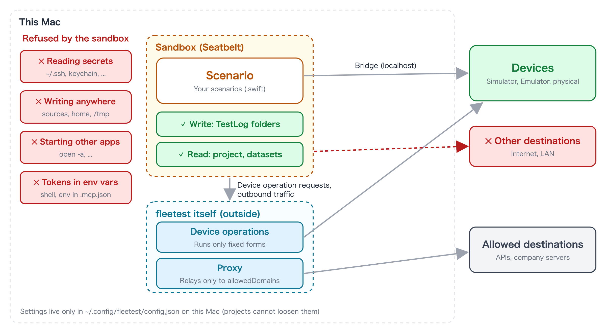

# The sandbox

[in Japanese(日本語)](sandbox_ja.md)

A fleetest scenario (`.swift`) is a Swift program. Besides driving the screen, it can contain code that reads and
writes files, talks to the network, or starts other programs. Scenarios are often written by an AI assistant, and you
may also run scenarios you received from someone else. If wrong or malicious code slips in, it could read secrets on
this Mac and send them out, or rewrite settings.

So fleetest **always runs scenarios inside a macOS sandbox (Seatbelt)**. A sandbox is a mechanism where the OS
enforces which files, destinations and operations a process may touch. Whatever the scenario's code says, the OS
refuses anything that is not allowed.

## What it protects

| What is protected | What a scenario inside the sandbox cannot do |
|---|---|
| Secrets on this Mac | Read the usual places for credentials and personal data, such as `~/.ssh`, the keychain and browser profiles |
| Files on this Mac | Write anywhere other than the report directory and temporary folders (it cannot rewrite the scenario sources or fleetest itself either) |
| Sending data out | Connect to destinations you have not allowed |
| Other programs on this Mac | Start other apps, or drive a Simulator or Android device beyond fleetest's fixed set of operations |
| The environment fleetest was started from | Read environment variables such as tokens set in your shell or in `.mcp.json` |

The threats it is designed for are wrong code written by an AI assistant, code an agent runs through MCP, and
scenarios received from someone else.

There are also **things it does not protect**. Operations on the app under test and its accounts (deleting,
purchasing, and so on) are the test itself, so they are not blocked. Services running on this Mac's localhost are
also reachable. See [Notes and limitations](limitations.md) for details.

## How it works

- **Everything is denied first, and only what is needed is opened.** A sandbox that only narrows writes and network
  access lets code run outside the box through other programs.
- **The sandbox is inherited by every process the scenario starts and cannot be removed from inside.** If a scenario
  starts `curl`, it runs under the same restrictions.
- **fleetest itself performs device operations on the scenario's behalf.** The `simctl`, `devicectl` and `adb` calls a
  scenario makes to drive a Simulator, a physical iOS device or an Android device are sent to fleetest, which runs only
  fixed forms of operations, and only on the devices the scenario is using. DSL commands (`tap`, `installApp`,
  `clearAppData`, ...) go through this path, so nothing changes in how you write them.
- **Outbound traffic goes through fleetest's proxy.** The sandbox cannot narrow destinations by domain name or IP
  address, so a scenario cannot reach the outside directly; fleetest's proxy relays only to the allowed destinations
  ([Accessible folders and destinations](access.md)).

## Always on

- **It is the same wherever you run from**: `fleetest run`, dry-run, MCP (`ft_run_scenario`, `ft_dry_run`, ...), the
  VSCode extension (running tests and listing steps) and runs on a remote runner all run inside the sandbox.
- **Its settings live only in `~/.config/fleetest/config.json` on the Mac that runs the scenario.** Projects, run
  profiles and environment variables cannot loosen it. A project is a place the AI assistant can rewrite, so a
  loosening switch there would defeat the sandbox. Scenarios cannot rewrite these settings either.
- In Claude Code, the installer writes a rule to `.claude/settings.json` in your work folder that denies edits to this
  settings folder.
- When running on another Mac (a remote runner), that Mac's settings apply.

## What runs outside the sandbox

Only the scenario binary and its descendants are inside the sandbox. The following run outside.

| Runs outside | Why / how it is handled |
|---|---|
| fleetest itself, the MCP server, the VSCode extension, the monitor | They prepare devices and provide the delegated operations and the proxy |
| The app under test | Runs inside the Simulator, Emulator or device |
| Evaluating `Package.swift` and building added dependencies | Runs in SwiftPM's and the compiler's own sandbox. Add only packages you trust |
| `setup.sh` / `teardown.sh` run before and after a run | They run with `fleetest run` and MCP's `ft_start_run`, not with `ft_run_scenario`. In MCP, a person accepts them through the confirmation (approval) of `ft_start_run` |

## Effect on speed

Each launch takes only about a dozen milliseconds longer, which hardly shows in the overall test time. Access to the
GPU and the Neural Engine needed for image matching and OCR is open, so image commands are not slower either.

## Related

- [Accessible folders and destinations](access.md) — writable places, unreadable places, destinations, firewall, settings file
- [Helpful features for writing test code](helpers.md) — features that make writing inside the sandbox easy
- [Notes and limitations](limitations.md)
- [MCP server](../reference/tools/mcp_server.md) — approval of MCP tools and the sandbox

### Link
- [index](../index.md)
