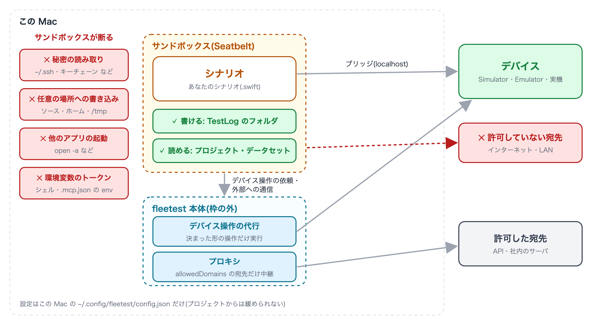

# サンドボックスの考え方

[in English](sandbox.md)

fleetest のシナリオ(`.swift`)は Swift のプログラムです。画面の操作だけでなく、ファイルを読み書きしたり、
外部へ通信したり、別のプログラムを起こしたりするコードも書けます。シナリオを書くのは AIアシスタントのことが多く、
他人から受け取ったシナリオを動かすこともあります。誤ったコードや悪意のあるコードが混ざると、この Mac の
秘密を読んで外へ送る・設定を書き換える、といったことが起こりえます。

そこで fleetest は、**シナリオを常に macOS のサンドボックス(Seatbelt)の中で実行します**。サンドボックスは、
プロセスが触れてよいファイル・通信先・操作を OS が強制する仕組みです。シナリオのコードに何が書かれていても、
許されていないことは OS が断ります。

## 何を守るのか

| 守るもの | サンドボックスの中のシナリオができないこと |
|---|---|
| この Mac の秘密 | `~/.ssh`・キーチェーン・ブラウザのプロファイルなど、認証情報と個人データの定番の置き場を読む |
| この Mac のファイル | レポートの出力先と一時フォルダ以外に書く(シナリオのソースや fleetest 本体も書き換えられません) |
| 外部への送信 | 許可していない宛先へ通信する |
| この Mac の他のプログラム | 他のアプリを起こす・Simulator や Android 端末を決まった操作以外で動かす |
| fleetest を起こした環境 | シェルや `.mcp.json` に置いたトークンなどの環境変数を読む |

想定している相手は、AIアシスタントが書いた誤ったコード、MCP 経由でエージェントが実行するコード、
他人から受け取ったシナリオです。

**守らないもの**もあります。テスト対象のアプリやアカウントへの操作(削除・購入など)は、テストそのものなので止めません。
この Mac の localhost で動くサービスにも繋がります。詳しくは[注意事項と制限事項](limitations_ja.md)を見てください。

## 仕組み

- **全部を禁止したうえで、要るものだけを開けます**。「書き込みと通信だけを絞る」形では、別のプログラムを経由して
  枠の外で処理を動かせてしまうためです。
- **枠はシナリオが起こしたプロセスにも引き継がれ、中から外すことはできません**。シナリオから `curl` を起こしても、
  同じ制限の中で動きます。
- **デバイスの操作は fleetest 本体が代わりに行います**。シナリオが Simulator・iOS 実機・Android 端末を操作するときの
  `simctl`・`devicectl`・`adb` の呼び出しは本体へ送られ、本体は決まった形の操作(シナリオが使っているデバイスに対するものだけ)を
  実行します。DSL のコマンド(`tap`・`installApp`・`clearAppData` など)はこの経路を通るので、書き方は何も変わりません。
- **外部への通信は本体のプロキシを通ります**。サンドボックスはドメイン名や IP アドレスで通信先を絞れないため、
  シナリオは直接には外へ出られず、本体のプロキシが許可した宛先だけを中継します
  ([アクセスできるフォルダと通信先](access_ja.md))。

## 常に有効

- **どこから実行しても同じです**。`fleetest run`・dry-run・MCP(`ft_run_scenario`・`ft_dry_run` など)・VSCode 拡張
  (テストの実行とステップ一覧の取得)・リモートランナーでの実行、のどれもサンドボックスの中で動きます。
- **設定はシナリオを実行する Mac の `~/.config/fleetest/config.json` だけに置きます**。プロジェクト・実行プロファイル・
  環境変数からは緩められません。プロジェクトは AIアシスタントが書き換えられる場所なので、そこに緩める口を置くと
  サンドボックスの意味がなくなるためです。シナリオ自身もこの設定を書き換えられません。
- Claude Code では、インストーラが作業フォルダの `.claude/settings.json` に、この設定フォルダの編集を拒否する設定を書きます。
- 別の Mac(リモートランナー)で実行するときは、その Mac の設定が使われます。

## サンドボックスの外で動くもの

サンドボックスに入るのはシナリオ実行バイナリとその子孫だけです。次のものは外で動きます。

| 外で動くもの | 理由・扱い |
|---|---|
| fleetest 本体・MCP サーバ・VSCode 拡張・モニター | デバイスを用意し、代行とプロキシを受け持つ側です |
| テスト対象のアプリ | Simulator・Emulator・端末の中で動きます |
| `Package.swift` の評価と、足した依存のビルド | SwiftPM とコンパイラ自身のサンドボックスで動きます。信頼できるパッケージだけを足してください |
| run の前後に走る `setup.sh` / `teardown.sh` | MCP では `ft_start_run` の確認(承認)で人が受けます |

## 速さへの影響

起動のたびに十数ミリ秒ほど増えるだけで、テスト全体の所要時間にはほとんど現れません。画像照合や OCR に要る
GPU・Neural Engine の利用は開けてあるので、画像系のコマンドも遅くなりません。

## 関連

- [アクセスできるフォルダと通信先](access_ja.md) —— 書ける場所・読めない場所・通信先・ファイアウォール・設定ファイル
- [テストコードを書くときの便利機能](helpers_ja.md) —— サンドボックスの中で無理なく書くための機能
- [注意事項と制限事項](limitations_ja.md)
- [MCP サーバ](../reference/tools/mcp_server_ja.md) —— MCP のツールの承認とサンドボックス

### Link
- [index](../index_ja.md)
