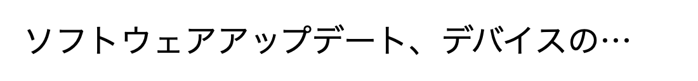

# テキストの視覚検証

[in English](text_visual_check.md)

`exist` や `textIs` は、まず木(アクセシビリティツリー)で要素を探します。ただ、木に要素があっても、
画面では別の物に覆われていたり、スクロールの外に切れていたりすることがあります。
**テキストの視覚検証**は、木で一致した要素について「その文字が画面に実際に描かれているか」を
スクリーンショットで確かめ、見えていなければ失敗にします。

- 対象のコマンド: `exist` / `waitForDisplay` / `select`(見えていなければ空要素を返す)/
  肯定形のテキスト・値の検証(`textIs` / `textContains` / `valueIs` など)
- 設定: 実行プロファイルの `textVisualCheck`(既定 `true`)と `ocrTextVisualCheck`(既定 `true`)
  ([実行プロファイルの設定項目](../project/run_profile_ja.md))
- ステップごとに外すときは `requireVisible: false`

確かめるのは「見えているか」だけです。値が期待どおりかは木の検証が保証するので、
ここでは値の違いを問いません。

## 判定の流れ

1. 端末の **OCR** が、期待のテキストを丸ごと読めれば、その場で緑にします(速い)。
2. 読めなければ **FM**(Foundation Models)が描かれている文字を書き起こし、期待のテキストと照合します。
3. FM が使えないとき(macOS 26・FM の不調)は、**OCR の読みだけ**で同じ規則を当てます。

画面の外(要素の中心が画面に無い)は、画像を見る前に失敗にします。

## 判定の例

画像は、判定の形を示すために iOS の日本語と同じフォント(ヒラギノ角ゴ・17pt)で描いた再現です。
「OCR の読み」と判定は、その画像を実際に判定に通した結果です。

### 見えている → 緑

| 画像 | 期待(木) | OCR の読み | 説明 |
|---|---|---|---|
|  | `アクセシビリティ` | `アクセシビリティ` | 丸ごと読めた |
|  | `“カレンダー”の新機能` | `“カレンダー”の新機能` | 丸ごと読めた。読みが半角の `"…"` でも、全角の `“…”` と揃えてから照合する |
|  | `在庫は残り5点です` | `在庫は残り3点です` | 期待に近い文字が描かれているので緑(値の正しさは木の検証が見る) |
|  | `アクセシビリティ` | `アクセシビリティ` | 覆いが半透明で、下の文字が読める |

空白・大文字と小文字・全角と半角の違いは、揃えてから照合します。期待が5文字以上なら、
1文字程度の誤読(`iCloud` を `¡Cloud` と読むなど)も許します。

### 先頭しか描かれていない → 緑 + 注記

| 画像 | 期待(木) | OCR の読み | 判定 |
|---|---|---|---|
|  | `ソフトウェアアップデート、デバイスの言語、…`(長い説明文) | `ソフトウェアアップデート、デバイスの・・・` | 緑 + 注記 `text-ellipsized`(アプリの意図した省略) |
|  | `通知を許可する` | `通知を許可` | 緑 + 注記 `text-partially-hidden`(半分より多く見えている) |

- 末尾に省略記号(`…`)が描かれていれば、読めた割合に関わらず緑です。日本語のフォントは `…` を
  字の中央の高さの点で描くので、OCR は `・・・` や `•••` と読みます。点の並びも省略記号として扱います。
- 省略記号が無く、描かれているのが期待のテキストの**半分より多い**ときは緑です。注記の文言は
  `part of the text is hidden`(テキストの一部が隠れています)です。

### 見えていない → 失敗

| 画像 | 期待(木) | OCR の読み | 失敗の理由 |
|---|---|---|---|
|  | `アクセシビリティ` | `アクセシ` | 描かれているのが半分以下(`most of the text is hidden`) |
|  | `アクセシビリティ` | `ビリ` | 末尾側だけが描かれている = 先頭が覆われている(`covered`) |
|  | `アクセシビリティ` | (何も読めない) | 文字が描かれていない(`notRendered`) |
|  | `アクセシビリティ` | (何も読めない) | 無地の覆いで全体が隠れている(`notRendered`) |
|  | `アクセシビリティ` | `スクリーンタイム` | 期待と無関係な文字が描かれている(`textMismatch`) |

失敗の文言は `false positive (occlusion): present in the tree but not visually visible [<理由>] ...` です。
FM が使えず OCR だけで判定したときは、`judged by OCR alone because FM gave no verdict` と出ます。
どちらも、すぐには失敗にせず、待ち時間(`waitSeconds`)のあいだ撮り直して、見えるようになれば緑にします。

### OCR では判定できない形 → FM が判定

| 画像 | 期待(木) | OCR の読み | 判定 |
|---|---|---|---|
|  | `アクセシビリティ` | (何も読めない) | 読める文字は無いが、ボタンやアイコンのような何かが描かれている。FM が書き起こし(何も無い)と照合して失敗にする |

OCR は、文字の上に別の絵が描かれた形や、文字の一部だけが残った形を判定できないことがあります。
この形は FM が判定します。FM が使えない環境では、確かめられずに緑のまま通ります。

## 失敗したときに確かめること

- **スクリーンショットが古くないか**: 木は正しい画面なのに、スクリーンショットが前の画面のまま
  になっていることがあります。VSCode 拡張のデバイスモニターが Android Emulator の画面を配信している
  間に、実際に起きています。レポートの失敗時のスクリーンショットが、別の画面になっていないかを
  見てください。

  

  上の画像は実際の例で、期待 `agree=false` の位置を切り出したものです。写っていたのは、
  前のシナリオの地図画面の灰色の領域でした。
- **本当に隠れていないか**: キーボード・シート・バナーなどが要素に重なっていないか。

## 制限

- 先頭の数文字しか見えない短い省略は、`…` を点1つとしか読めず、省略記号と判定できないまま
  失敗になることがあります。
- 半透明の覆いは、下の文字が読める限り「見えている」とみなします。
- FM が使えない環境では、OCR で判定できない形(上の「FM が判定」の形)を確かめられません。
  FM が使えるかは `fleetest doctor --fm-only` で確かめられます。

### Link
- [index](../index_ja.md)
