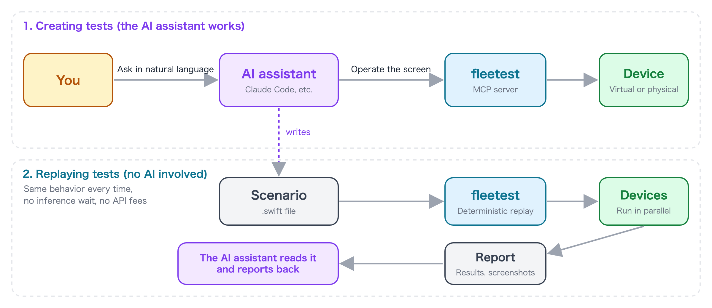

# How to Ask an AI Assistant

fleetest is designed to be used by **asking an AI assistant such as Claude Code in natural language**.
You do not need to read or write test scenarios (Swift files) or MCP tools yourself ——
the AI assistant operates the app on a device, reads the screen, writes the scenarios, runs them, and reports the results.

This page explains what you can ask for and a pattern for asking well. If you have not run anything yet,
go through the [Quick Start](../quick-start.md) first.

## What you can ask for

| Example request | Details |
|---|---|
| "Create fleetest profiles for this app" | [Prepare the app and devices](preparing_app_and_devices.md) |
| "Create an exploratory test that covers only the login screen" | [Create tests](creating_tests.md) |
| "Run the scenarios you created on iOS" | [Run tests](running_tests.md) |
| "Summarize the current run results. If there are failures, investigate the cause" | [Read results and investigate failures](investigating_failures.md) |
| "I changed the design of the login screen, so fix the related tests" | [Keep tests up to date with app changes](keeping_up_with_app_changes.md) |
| "Set up another Mac so it can be used as a runner machine" | [Remote Runners](../fleet/remote_runners.md) |
| "Create a setup that runs this project's tests on Jenkins" | [Run in CI](../in_action/ci.md) |

You can watch runs in the VSCode extension's device monitor ([Watch in VSCode](watching_in_vscode.md)).

## A pattern for asking

### 1. Narrow the target

"**Only the login screen**" finishes faster and more reliably than "create tests for the whole app".
Limit each request to **one screen or one flow of operations**, and when it is done, ask for the next screen.

### 2. Add the OS and device

Saying whether to run on iOS or Android makes the result more reliable.

```text
Create an exploratory test for just the cart screen, on Android.
```

If you know the name of the run profile (the setting that says which devices to run on), writing it is the
most reliable ("run it with the ios profile").

### 3. Write the completion condition

Saying where to stop keeps the AI assistant from drifting into extra work.

```text
... Stop once you've told me the file name of the new scenario. There's no need to run it on a device.
```

### 4. Make the request independent of the conversation

Phrases like "with the app you just built" or "the one you made in step 1" do not work when pasted into a new session or a
different AI assistant. **Write with concrete names, such as the app name, app ID and screen name**, and
the request gives the same result wherever and whenever you paste it.

### 5. Keep the judgment with the human

An AI assistant can confuse an "app bug" with a "problem in how the test is written".
**Whether it is acceptable to rewrite the app's expected values** when a test fails is for you to decide.

```text
Find out why it failed and report back. Don't fix the scenario yet.
```

With a request like this, you can separate the investigation from the fix.

## What the AI assistant does behind the scenes



The AI assistant that receives your request works using fleetest's **MCP server** (`ft_*` tools) and the **Claude Code skills**.

- Reads the screen, taps, and types text (actually operates the app on a device)
- Writes test scenarios (`TestProjects/<project>/scenarios/*.swift`) from the elements read from the screen
- Verifies in this order: compile, verification without a device (dry-run), then a run on a device

**AI is not used to replay a finished test.** A scenario is replayed deterministically as code, so
the same test behaves the same way every time, with no inference wait time and no API usage fees.

To learn what happens inside, see the reference pages
[MCP server](../reference/tools/mcp_server.md) and [Claude Code skills](../reference/tools/claude_code_skills.md).

## AI assistants other than Claude Code

You can also use MCP-capable AI assistants such as Codex and Cline. For how to register them and the caveats (such as the Codex sandbox), see
[AI assistants other than Claude Code](../reference/tools/other_agents.md).

### Link
- [index](../index.md)
