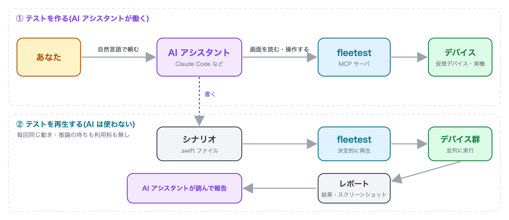

# AIアシスタントへの頼み方

fleetest は、Claude Code などの AIアシスタントに**自然言語で頼んで**使うことを前提にしています。
テストシナリオ(Swift のファイル)や MCP のツールを、あなたが直接読み書きする必要はありません ——
AIアシスタントがデバイス上のアプリを実際に操作して画面を読み、シナリオを書き、実行し、結果を報告します。

このページでは、どんなことを頼めるのかと、うまく頼むための型を説明します。まだ一度も動かしていなければ、
先に[クイックスタート](../quick-start_ja.md)を通してください。

## 頼めること

| 頼み方の例 | 詳しく |
|---|---|
| 「このアプリ向けに fleetest のプロファイルを作って」 | [アプリとデバイスを用意する](preparing_app_and_devices_ja.md) |
| 「ログイン画面だけを対象に、探索的テストを作成して」 | [テストを作る](creating_tests_ja.md) |
| 「作成したシナリオを ios プロファイルで実行して」 | [テストを実行する](running_tests_ja.md) |
| 「今の実行結果を要約して。失敗があれば原因を調べて」 | [結果を読み、失敗を調べる](investigating_failures_ja.md) |
| 「ログイン画面のデザインを変えたので、関係するテストを直して」 | [アプリの変更にテストを追従させる](keeping_up_with_app_changes_ja.md) |
| (VSCode 拡張のデバイスモニターで見る) | [VSCode で見る](watching_in_vscode_ja.md) |
| 「別の Mac をランナー機として使えるようにして」 | [リモートランナー](../in_action/remote_runners_ja.md) |
| 「このプロジェクトのテストを Jenkins で回す設定を作って」 | [CI で回す](../in_action/ci_ja.md) |

## 頼み方の型

### 1. 対象を絞る

「アプリ全体のテストを作って」より「**ログイン画面だけを対象に**」のほうが、速く、確実に終わります。
1回の依頼で扱うのは**1画面か1つの操作の流れ**にし、終わったら次の画面を頼んでください。

### 2. OS とデバイスを添える

iOS と Android のどちらで動かすかは、指示に添えると確実です。

```text
カート画面だけを対象に、Android で探索的テストを作成して。
```

実行プロファイル(どのデバイスで動かすかの設定)の名前が分かっていれば、それを書くのが一番確実です
(「ios プロファイルで実行して」)。

### 3. 完了条件を書く

どこまでやったら終わりかを書くと、AIアシスタントが余計な作業に進みません。

```text
… 完了条件: 作成したシナリオのファイル名を報告。デバイスでの実行は不要。
```

### 4. 会話に依存しない文にする

「さっきビルドしたアプリで」「ステップ1で作ったもの」のような言い方は、新しいセッションや別の
AIアシスタントに貼ると通じません。**アプリの名前・アプリ ID・画面名など、具体的な名前で書く**と、
いつどこに貼っても同じ結果になります。

### 5. 判断は人が持つ

AIアシスタントは「アプリの不具合」と「テストの書き方の問題」を取り違えることがあります。
テストが落ちたときに**アプリの期待値を書き換えてよいか**は、あなたが決めてください。

```text
失敗の原因を調べて報告して。シナリオはまだ直さないで。
```

と頼めば、調査と修正を分けられます。

## AIアシスタントが裏でしていること



依頼を受けた AIアシスタントは、fleetest の **MCP サーバ**(`ft_*` ツール)と **Claude Code のスキル**を
使って作業します。

- 画面を読む・タップする・文字を入れる(デバイス上のアプリを実際に操作する)
- 読み取った画面の要素から、テストシナリオ(`TestProjects/<プロジェクト>/scenarios/*.swift`)を書く
- コンパイル → デバイス無しの検証(dry-run)→ デバイスでの実行、の順で確かめる

**できあがったテストの再生には AI を使いません**。シナリオはコードとして決定的に再生されるので、
同じテストは毎回同じ動きをし、推論の待ち時間も API の利用料もかかりません。

中で何が起きているかを知りたいときは、リファレンスの
[MCP サーバ](../reference/tools/mcp_server_ja.md)・[Claude Code のスキル](../reference/tools/claude_code_skills_ja.md)を
参照してください。

## Claude Code 以外の AIアシスタント

Codex・Cline など MCP に対応した AIアシスタントでも使えます。登録の方法と注意点(Codex のサンドボックスなど)は
[その他のエージェント](../reference/tools/other_agents_ja.md)を参照してください。

### Link
- [index](../index_ja.md)
