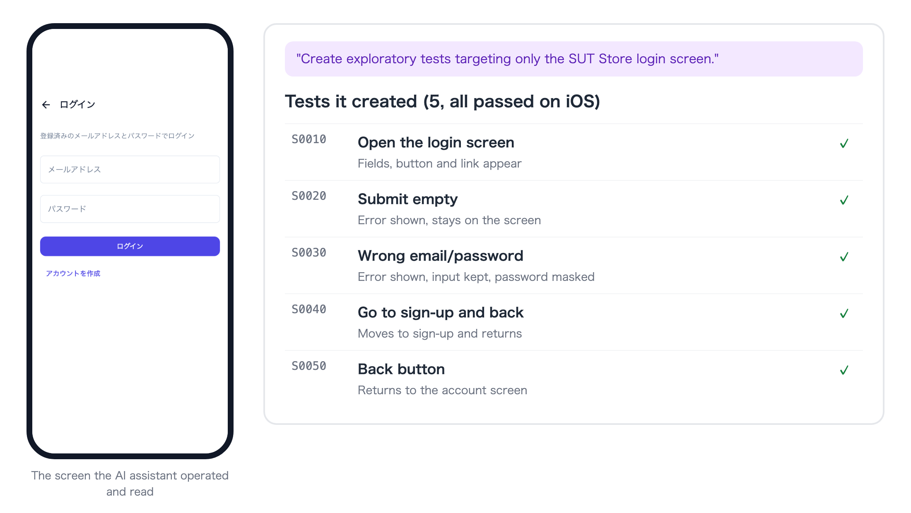
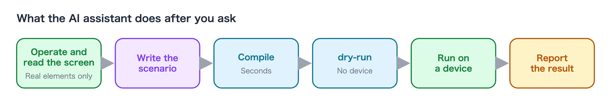

# Create Tests

You have an AI assistant create the tests. The AI assistant actually operates the app on a device and
writes the test scenario while reading the elements shown on the screen. It never writes buttons or IDs that
are not on the screen from imagination.

The result is a Swift file (scenario) under `TestProjects/<project>/scenarios/`.
You can use it without being able to read its contents, but if you want to check what gets written, see the [reference](#more-details).

## Create an exploratory test

You specify a screen and let the AI assistant decide what to check as well. This suits your first test.

### Do it with the AI assistant

```text
Create an exploratory test that covers only the My Shop login screen.
```

The AI assistant operates the login screen, tries invalid input, submitting with empty fields, moving between screens and so on,
and turns the behavior it finds into a scenario. At the end of the work it runs the compile and the verification without a device (dry-run),
runs the scenario on a device, and reports the result.

Here is the result of actually asking this for the sample app ([SUT Store](https://github.com/wave1008/sut-ec-mobile)).





## Turn a fixed procedure into a test

When the steps you want to check are already decided, write the steps and "what must be visible for it to succeed".

### Do it with the AI assistant

```text
Create a test for My Shop with the following steps. Create it on iOS.
1. Open the first product in the product list
2. Tap "Add to cart"
3. Open the cart screen
What to check: the cart contains 1 item, and its product name is the same as the product opened from the list.
```

If you do not write "what to check", you may get a test that only performs operations and verifies nothing.
**Always write the success condition.**

## Add to an existing test

### Do it with the AI assistant

```text
Add a case to the My Shop login test: when the password is shorter than 8 characters, an error message is shown.
```

Even if you do not know which file the existing scenario is in, the AI assistant finds it.

If the behavior you ask for is not in the app (in the example above, there is no message specific to passwords under 8 characters
and the same error as a wrong password appears), the AI assistant checks the actual behavior, reports it, and leaves the
decision of whether that matches the specification to you.

## Make a test that runs on both iOS and Android

For an app with the same screens and the same IDs (such as Compose Multiplatform, Flutter, or React Native),
one scenario can run on both OSes.

```text
Make the My Shop login test run on both iOS and Android. Run it on both devices to confirm.
```

For parts where the screens differ by OS, the AI assistant writes them separately as per-OS branches.

## Handle screens that may or may not appear

Screens that sometimes appear and sometimes do not, such as first-launch guides, announcement dialogs, and OS permission dialogs,
are the biggest cause of unstable tests. When you notice one, mention it in your request.

```text
My Shop sometimes shows a dialog called "Spring campaign" right after launch. It closes with "Close" at the top right.
Fix the login test so that it closes the dialog if it appears and then continues.
```

**Include the dialog's name and the label of its close button** (and, if you can, a screenshot of the screen while it is shown).
The AI assistant only writes elements it has seen on the screen into a test, so if the dialog does not appear while it looks,
it ends up relaunching the app again and again without a clue.

## Creating by recording (VSCode)

There is also a way to create tests without an AI assistant. In the "Live Control" tab of the VSCode extension's device monitor,
press "Start Recording", operate the app shown on screen, and then press "Stop Recording"; your
operations become a scenario. A scenario created by recording has no "what must be visible for it to succeed", so

```text
There is a scenario created by recording in scenarios/Generated/. Add verification of what is shown on the screen to each scene.
```

ask the AI assistant to finish it like this, and it becomes a complete test. For details, see
[Watch in VSCode](watching_in_vscode.md).

## When it does not go well

| Symptom | What to ask |
|---|---|
| The work drags on or goes off track | Narrow the target again to one screen or one flow. Write the completion condition |
| It is exploring on the wrong device | Specify the run profile's name ("on the devices of the ios profile") |
| The test sometimes passes and sometimes fails | "Run this test 5 times, and if some runs fail, investigate the cause" |
| Elements lower on the screen are not reached | "Make it reach elements that are only visible after scrolling" |

## More details

References for when you want to read and write the contents of a scenario (the Swift DSL).

- [Creating a test class](../reference/testclass/creating_testclass.md) and [Test code structure](../reference/testclass/testcode_structure.md)
- [Selector expressions](../reference/selector/selector_expression.md) (how to point at elements on the screen)
- [Writing robust scenarios](../reference/writing/writing_robust_scenarios.md)
- [How to write for each UI component, and its quirks](../reference/writing/ui_component_patterns.md)

### Link
- [index](../index.md)
