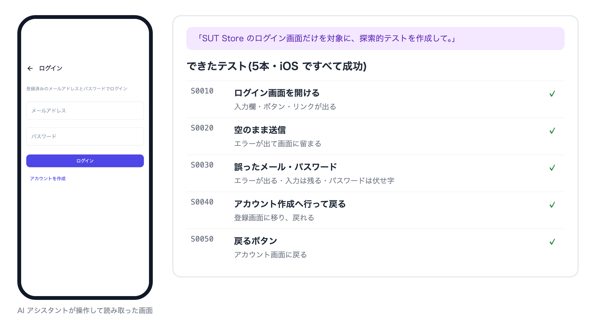
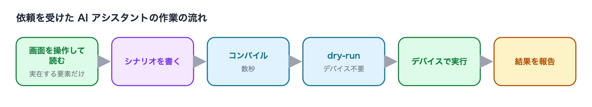

# テストを作る

テストは AIアシスタントに作らせます。AIアシスタントはデバイス上でアプリを実際に操作し、
画面に出ている要素を読み取りながらテストシナリオを書きます。画面に無いボタンや ID を想像で書くことは
ありません。

できあがるのは `TestProjects/<プロジェクト>/scenarios/` 配下の Swift ファイル(シナリオ)です。
中身を読めなくても使えますが、書かれる内容を確かめたいときは[リファレンス](#もっと詳しく)を参照してください。

## 探索的テストを作る

画面を指定して、AIアシスタントに確かめる内容ごと考えさせる頼み方です。最初の1本に向いています。

### AIへの指示文

```text
My Shop のログイン画面だけを対象に、探索的テストを作成して。
```

AIアシスタントはログイン画面を操作して、誤った入力・空欄のままの送信・画面内の移動などを試し、
見つけた挙動をシナリオに落とします。作業の最後にコンパイルとデバイス無しの検証(dry-run)を通し、
デバイスで実行して結果を報告します。

サンプルアプリ([SUT Store](https://github.com/wave1008/sut-ec-mobile))で実際に頼んだときの結果です。





## 決まった手順をテストにする

確かめたい手順が決まっているときは、手順と「何が見えたら成功か」を書きます。

### AIへの指示文

```text
My Shop で、次の手順のテストを iOS で作成して。
1. 商品一覧の先頭の商品を開く
2. 「カートに入れる」を押す
3. カート画面を開く
最後に、カートに 1 件入っていて、その商品名が一覧で開いた商品と同じであることを確かめて。
```

「確かめること」を書かないと、操作だけで何も検証しないテストができることがあります。
**成功の条件は必ず書いてください**。

## 既存のテストに足す

### AIへの指示文

```text
My Shop のログインのテストに、パスワードを 8 文字未満にしたときにエラーメッセージが出るケースを追加して。
```

既存のシナリオがどのファイルか分からなくても、AIアシスタントが探します。

頼んだ挙動がアプリに無いとき(上の例なら、8 文字未満専用のメッセージが無く、誤ったパスワードと同じエラーが出るとき)は、
AIアシスタントは実際の挙動を確かめて報告し、それが仕様どおりかの判断をあなたに返します。

## iOS と Android の両方で動くテストにする

同じ画面・同じ ID を持つアプリ(Compose Multiplatform・Flutter・React Native など)なら、
1本のシナリオを両方の OS で動かせます。

```text
My Shop のログインのテストを iOS と Android の両方で動くように直し、両方のデバイスで実行して確かめて。
```

OS で画面が違う部分は、AIアシスタントが OS ごとの分岐として書き分けます。

## 出るか分からない画面を扱う

初回起動の案内・お知らせのダイアログ・OS の許可ダイアログなど、出たり出なかったりする画面は、
テストを不安定にする一番の原因です。見かけたら、その旨を添えて頼みます。

```text
My Shop は起動直後に「春のキャンペーン」というダイアログが出ることがある。右上の「閉じる」で閉じられる。
ダイアログが出たら閉じてから進むように、ログインのテストを直して。
```

**ダイアログの名前と、閉じるボタンの文言を添えてください**(分かれば、出ているときの画面の写真も)。
AIアシスタントは画面で見た要素しかテストに書かないので、探している間にダイアログが出なければ、
手がかりが無いまま何度もアプリを起動し直して探すことになります。

## 録画して作る(VSCode)

AIアシスタントを使わずに作る方法もあります。VSCode 拡張のデバイスモニターの「ライブ操作」タブで
「レコーディング開始」を押し、画面に映ったアプリを操作してから「レコーディング終了」を押すと、
操作がシナリオになります。録画で作ったシナリオには「何が見えたら成功か」が入らないので、

```text
scenarios/Generated/ に、録画で作ったシナリオがある。各 scene に、画面に出ている内容の検証を足して。
```

と AIアシスタントに仕上げを頼むと、テストとして完成します。詳しくは
[VSCode で見る](watching_in_vscode_ja.md)。

## うまくいかないとき

| 症状 | 頼み方 |
|---|---|
| 作業が長引く・脱線する | 対象を1画面・1つの流れに絞り直す。完了条件を書く |
| 違うデバイスで探索している | 実行プロファイルの名前を指定する(「ios プロファイルのデバイスで」) |
| テストが通ったり落ちたりする | 「このテストを5回実行して、落ちる回があれば原因を調べて」 |
| 画面の下のほうの要素に届かない | 「スクロールしないと見えない要素にも届くようにして」 |

## もっと詳しく

シナリオの中身(Swift の DSL)を読み書きしたいときのリファレンスです。

- [テストクラスの作成](../reference/testclass/creating_testclass_ja.md)・[テストコードの構造](../reference/testclass/testcode_structure_ja.md)
- [セレクタ式](../reference/selector/selector_expression_ja.md)(画面の要素の指し方)
- [壊れにくいシナリオの書き方](../reference/writing/writing_robust_scenarios_ja.md)
- [UI 部品ごとの書き方と癖](../reference/writing/ui_component_patterns_ja.md)

### Link
- [index](../index_ja.md)
