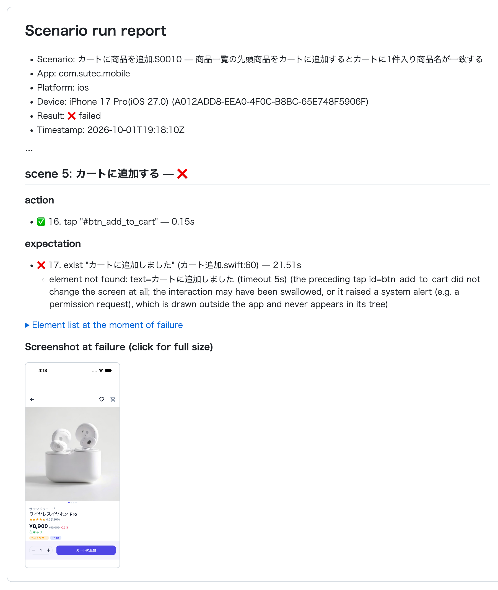

# Reading Results and Investigating Failures

Every time you run tests, the results are kept, pass or fail. You can leave the reading to the AI assistant too.

## Have the results summarized

### Do it with the AI assistant

```text
Summarize the most recent fleetest run. If there are failures, list the failed scenarios and the steps where they failed.
```

<details>
<summary><b>Do it manually (click to show details)</b></summary>

- Each scenario has a Markdown report under `TestProjects/<project>/reports/`.
- In VSCode, the Test Explorer shows pass/fail directly, and you can open the report from there.
  The command "fleetest: Open Results Dashboard" also shows the run history and success rate.

</details>

## Have the cause of a failure investigated

The report contains the failed step, the failure message, and **the element list and screenshot of the screen at the moment of failure**.
The AI assistant can read them and explain what happened.

Below is an excerpt of a real report (from the sample app: a test that failed while waiting for a message shown only briefly after adding to the cart).



### Do it with the AI assistant

```text
For the scenarios that failed in the most recent fleetest run, investigate the cause from the reports and report back.
Also separate whether it looks like an app bug or a problem with how the test is written. Don't fix the scenarios yet.
```

**Adding "don't fix them" matters**. If you ask the AI assistant to investigate and fix at the same time,
a test that failed because of an app bug may get made to pass by "adjusting the expected value to match the app".
That means the test starts missing the bug. Read the report first, then you decide whether to fix it.

### Once you have a hunch about the cause

| Hunch | How to ask next |
|---|---|
| An app bug | Leave the test as is. After the app is fixed: "Re-run only the scenarios that failed last time" |
| The screen changed and the test is outdated | "The ... screen changed, so update this scenario to match the current screen" ([Keeping up with app changes](keeping_up_with_app_changes.md)) |
| A dialog that sometimes appears interrupted the test | "A ... dialog sometimes appears right after launch. Fix the scenario so it closes the dialog if it appears and then continues" |
| Not sure | "Run this scenario 5 times and find out what differs between the runs that fail and the runs that pass" |

## fleetest does not jump to conclusions about causes

What fleetest records is only the facts: **at which stage, which operation, and how it failed**.
It does not record guesses about the cause, such as "the app was slow" or "the Mac was busy" — the tool has no way to
tell them apart, and a guess written down would lead to wrong decisions. When you read the AI assistant's explanation, check
whether it is based on the facts written in the report.

## Find unstable tests

If you keep running tests, you start to see tests that sometimes pass and sometimes fail.

### Do it with the AI assistant

```text
From the past fleetest run results, find the unstable scenarios that sometimes pass and sometimes fail, and the scenarios that have been getting slower.
```

<details>
<summary><b>Do it manually (click to show details)</b></summary>

```bash
fleetest results flaky      # Scenarios that both pass and fail
fleetest results insights   # Regressions, consecutive failures, scenarios that got slower, bias toward specific devices, etc.
fleetest results slow       # In descending order of average duration
```

</details>

## Look back at how a run went

- If you enable recording in the run profile, a video is kept for each scenario. Asking
  "enable recording in the ios profile" sets it up. You can watch recordings in the "Test Sessions" tab of the VSCode extension ([Watching in VSCode](watching_in_vscode.md)).
- Per-scenario execution logs (the pass/fail of each step and the output produced during the run) are also kept.
  Ask "show me the execution log of the login test in the most recent run" to read it.

## When it might be a bug in fleetest itself

If, after having the AI assistant investigate, the cause seems to be on the tool's side, report it to the maintainers.
How to put together the diagnostic information to attach to the report is in [Troubleshooting](../in_action/troubleshooting.md).

## Learn more

- [Test result files](../reference/testclass/test_result_files.md) — what is written where
- [Analyzing results (fleetest results and the dashboard)](../reference/running/results_analysis.md)

### Link
- [index](../index.md)
