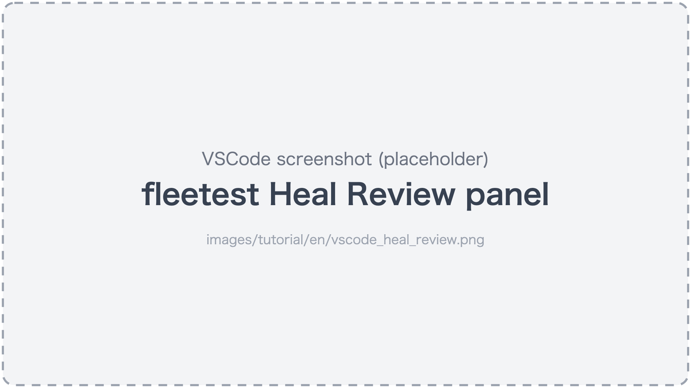

# Keeping Tests Up with App Changes

[in Japanese(日本語)](keeping_up_with_app_changes_ja.md)

Apps keep changing. A button's ID changes, a screen's layout changes, a new dialog appears --
and each time, the work of fixing the tests can also be left to the AI assistant.

## Self-healing absorbs small changes

A common change, where only a button's ID changes while its visible text (label) stays the same, is
absorbed on the spot by fleetest's **self-healing**, and the test continues.

- Self-healing remembers, from the previous run, "what kind of element it was and what text it had",
  and when **exactly one** element with the same characteristics is on the screen, it uses that element instead.
  When there are multiple candidates it does not use any (reporting a failure is safer than mixing up elements).
- It does not use AI. The result is the same every time.
- It is enabled in runs that use a run profile, through the run profile's `heal` setting (default `true`).

If a step passed thanks to self-healing, the report keeps a **suggestion** like "change this line of the scenario this way".
**Scenario files are never rewritten automatically**.

### Apply the suggestions to the scenario

#### Prompt for the AI

```text
Review the self-healing suggestions in the latest fleetest report and apply the reasonable ones to the scenarios.
Then run those scenarios and confirm they pass.
```

<details>
<summary><b>Do it manually (click to show details)</b></summary>

If you run from the VSCode Test Explorer and repair suggestions are produced, a "fleetest Heal Review" panel opens at the end of the run (`heal` in the run profile is on by default).
Compare the before and after, choose the suggestions to apply, and press "Apply N selected".



</details>

## When the screen changes

When the screen layout or the steps themselves change, self-healing can't keep up. Ask while including what changed.

### Prompt for the AI

```text
The My Shop login screen has a new design (the email address and password are now on separate screens).
Update the login-related fleetest scenarios to match the current screens, then run them to confirm.
```

The AI assistant actually operates the current screens, reads them again, and rewrites the scenarios.

**Note**: Avoid asking only "make the failing tests pass". Tests that are failing because of an app bug
would also get rewritten "so that they pass". The point is to include **what the intended change is**.

## When new interruptions appear

When the app gains new announcement dialogs, surveys, OS permission dialogs and so on,
many tests may fail all at once. It is more efficient to ask for them to be handled together than to fix test by test.

```text
My Shop now sometimes shows a "What's new" dialog right after launch.
Update every test so that, if the dialog appears, it taps "Close" and continues.
```

## Make tests harder to break

Tests that fail with every app change are worth rethinking in how they are written.

```text
Review the fleetest scenarios and list anything written in a way that is likely to break when the app's text changes or the screen size differs.
Don't fix anything until I've reviewed the list.
```

The viewpoints for robustness are collected in [Writing robust scenarios](../reference/writing/writing_robust_scenarios.md).
The AI assistant also reviews from these viewpoints.

## Tests you no longer use

For tests of a feature whose screen is gone entirely, you can keep them by marking them as "deprecated" instead of deleting them
(marked tests run only when you name them explicitly).

```text
The My Shop coupon screen has been removed. Mark the coupon-related scenarios as deprecated.
```

## Learn more

- [Self-healing](../reference/running/self_healing.md) — how it works and its settings
- [Creating a test class](../reference/testclass/creating_testclass.md) — the incomplete and deprecated marks
- [Maintenance for long-term use](../in_action/maintenance.md)

Next: [Watching in VSCode](watching_in_vscode.md)

### Link
- [index](../index.md)
