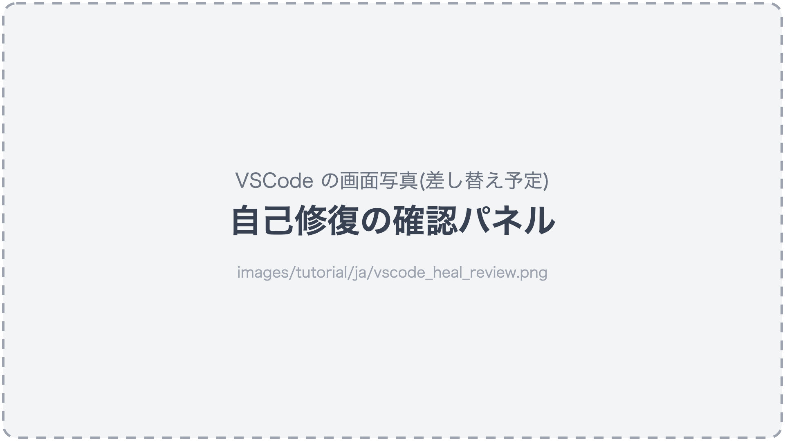

# アプリの変更にテストを追従させる

アプリは変わり続けます。ボタンの ID が変わる、画面の構成が変わる、新しいダイアログが増える ——
そのたびにテストを直す作業も、AIアシスタントに任せられます。

## 小さな変化は自己修復が吸収する

ボタンの ID だけが変わって、見た目の文言(ラベル)が同じ、というよくある変化は、fleetest の
**自己修復**がその場で吸収してテストを続けます。

- 自己修復は、前回の実行でその要素が「どんな種類で、どんな文言だったか」を覚えておき、
  同じ特徴の要素が**画面にちょうど1つだけ**あるときに、それを代わりに使います。
  候補が複数あるときは使いません(取り違えるより、失敗として知らせるほうが安全なため)。
- AI は使いません。毎回同じ結果になります。
- 実行プロファイルを使った実行では、既定で有効です。

自己修復で通った手順があると、レポートに「シナリオのこの行を、こう直してください」という**提案**が残ります。
**シナリオのファイルが勝手に書き換わることはありません**。

### 提案をシナリオに反映する

#### AIへの指示文

```text
fleetest の直近のレポートにある自己修復の提案を確認し、妥当なものをシナリオに反映して。
反映したら、そのシナリオを実行して通ることを確かめて。
```

<details>
<summary><b>手動で実行(クリックで詳細表示)</b></summary>

VSCode 拡張から自己修復を有効にして実行すると、提案が出たときに「fleetest 自己修復の確認」パネルが開きます。
変更前と変更後を見比べて、適用する提案を選んで「選択した N 件を適用」を押します。



</details>

## 画面が変わったとき

画面のレイアウトや手順そのものが変わったときは、自己修復では追いつきません。何が変わったかを添えて頼みます。

### AIへの指示文

```text
My Shop のログイン画面が新しいデザインに変わった(メールアドレスとパスワードが別の画面に分かれた)。
ログインに関係する fleetest のシナリオを今の画面に合わせて直し、実行して確かめて。
```

AIアシスタントは今の画面を実際に操作して読み直し、シナリオを書き換えます。

**注意**: 「落ちているテストを通るようにして」とだけ頼むのは避けてください。アプリの不具合で
落ちているテストまで「通るように」書き換えられてしまいます。**何が意図した変更なのか**を添えるのが要点です。

## 新しい割り込みが増えたとき

アプリに新しいお知らせダイアログ・アンケート・OS の許可ダイアログなどが増えると、
多くのテストが一斉に落ちることがあります。テストごとに直すより、まとめて扱うよう頼むのが効率的です。

```text
My Shop の起動直後に、ときどき「新機能のお知らせ」ダイアログが出るようになった。
どのテストでも、このダイアログが出たら「閉じる」を押して先へ進むようにして。
```

## テストを壊れにくくする

アプリの変更のたびに落ちるテストは、書き方を見直す価値があります。

```text
fleetest のシナリオを見直して、アプリの文言変更や画面サイズの違いで壊れやすい書き方があれば一覧にして。
直すのは、私が一覧を確認してからにして。
```

壊れにくさの観点は[壊れにくいシナリオの書き方](../reference/writing/writing_robust_scenarios_ja.md)にまとまっています。
AIアシスタントもこの観点で見直します。

## 使わなくなったテスト

画面ごと無くなった機能のテストは、削除せずに「廃止」の印を付けて残すこともできます
(印の付いたテストは、名指ししたときだけ実行されます)。

```text
My Shop のクーポン画面は廃止された。クーポンに関係するシナリオに廃止の印を付けて。
```

## もっと詳しく

- [自己修復](../reference/running/self_healing_ja.md) —— 仕組みと設定
- [テストクラスの作成](../reference/testclass/creating_testclass_ja.md) —— 未完成・廃止の印
- [長く使うためのメンテナンス](../in_action/maintenance_ja.md)

### Link
- [index](../index_ja.md)
