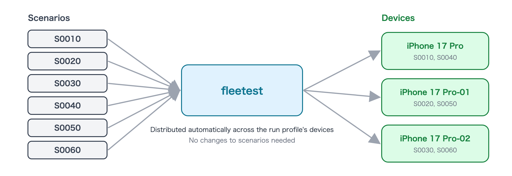

# Run Tests

A test you created runs the same way whether you ask an AI assistant or run it yourself from VSCode or the terminal.
**AI is not used for the run itself** —— scenarios are replayed deterministically as code, so the AI assistant only
plays the role of "starting the run and reading the results".

## Verify without a device (dry-run)

Before running on a device, a verification that does not use a device (dry-run) finds typos and missing verifications in a few seconds.

### Prompt for the AI

```text
Dry-run all fleetest scenarios and list any warnings.
```

<details>
<summary><b>Do it manually (click to show details)</b></summary>

```bash
../foundation-tester/.build/debug/fleetest run --dry-run
```

In VSCode, select a scenario in the Test Explorer and use "Run (dry-run)".

</details>

## Run

### Prompt for the AI

```text
Run all fleetest scenarios on iOS and report the results when it's done.
```

To run only one test or a subset, specify them by test name or screen.

```text
Run only the fleetest login test on Android.
```

<details>
<summary><b>Do it manually (click to show details)</b></summary>

```bash
# Everything
../foundation-tester/.build/debug/fleetest run --profile ios-run

# Per class (file) or per single test
../foundation-tester/.build/debug/fleetest run --profile ios-run --scenario LoginTest
../foundation-tester/.build/debug/fleetest run --profile ios-run --scenario LoginTest.S0010
```

In VSCode, select a scenario in the Test Explorer and click "Run".

</details>

The commands above assume the default layout, with the foundation-tester clone next to your work folder.
For details, see [Running scenarios](../reference/running/running_scenarios.md).

## Run faster on multiple devices

If the run profile contains multiple devices, scenarios are distributed automatically and run in parallel.
No change to the scenarios is needed. For how to add devices, see [Prepare the app and devices](preparing_app_and_devices.md).



When you want to run the same scenario once on every device (for example, to compare how it looks on each model), ask for that.

```text
Run the fleetest login test once on every iOS device.
```

## Re-run only the tests that failed

After fixing the app, you can run only the tests that failed last time to confirm.

```text
Re-run only the fleetest scenarios that failed on iOS last time.
```

<details>
<summary><b>Do it manually (click to show details)</b></summary>

```bash
../foundation-tester/.build/debug/fleetest run --profile ios-run --failed
```

</details>

## What happens on failure

- If even one place fails in the middle of a test, **the rest of that scenario is not run and it is aborted**
  (continuing to operate on a screen whose premise has broken produces wrong results or unintended operations).
  Other scenarios continue as they are.
- **A failed operation is never retried automatically.** This is so that operations that may or may not have
  arrived (such as submitting or purchasing) are not executed twice. For an unstable test, fix the cause instead of retrying
  ([Read results and investigate failures](investigating_failures.md)).
- Minor changes, such as only a screen ID having changed, are absorbed by **self-healing** and the test continues.
  Even then, the report keeps a suggestion saying "fix the scenario like this"
  ([Keep tests up to date with app changes](keeping_up_with_app_changes.md)).

## Run on another Mac or in CI

- Use the devices of another Mac: [Remote runners](../in_action/remote_runners.md)
- Run regularly on Jenkins or similar: [Run in CI](../in_action/ci.md)

## More details

- [Running scenarios (fleetest run)](../reference/running/running_scenarios.md) —— the full list of options
- [Dry-run](../reference/running/dry_run.md) and [Parallel execution](../reference/running/parallel_execution.md)

### Link
- [index](../index.md)
