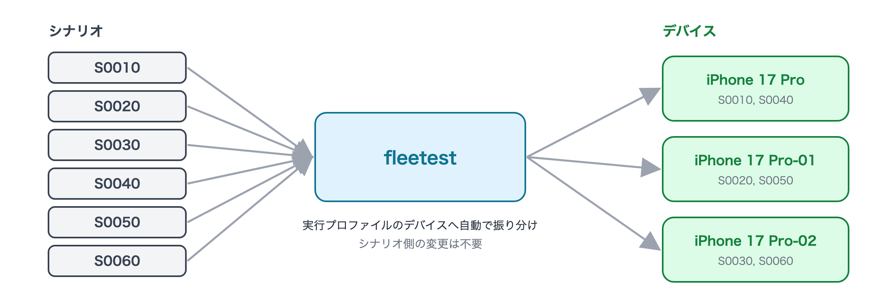

# テストを実行する

作ったテストは、AIアシスタントに頼んでも、VSCode・ターミナルから自分で動かしても、同じように実行されます。
**実行そのものに AI は使いません** —— シナリオはコードとして決定的に再生されるので、AIアシスタントは
「実行を始めて結果を読む」役だけを担います。

## デバイス無しで確かめる(dry-run)

デバイスで動かす前に、デバイスを使わない検証(dry-run)を通すと、書き間違い・検証の抜けを数秒で見つけられます。

### AIアシスタントで実行

```text
fleetest のシナリオを全部 dry-run で検証し、警告があれば一覧にして報告して。
```

<details>
<summary><b>手動で実行(クリックで詳細表示)</b></summary>

```bash
../foundation-tester/.build/debug/fleetest run --dry-run
```

VSCode では Test Explorer でシナリオを選び、「実行 (dry-run)」を使います。

</details>

## 実行する

### AIアシスタントで実行

```text
fleetest のシナリオを全部 iOS で実行し、終わったら成否を報告して。
```

1本だけ・一部だけを動かすときは、テストの名前や画面で指定します。

```text
fleetest のログインのテストだけを Android で実行して。
```

<details>
<summary><b>手動で実行(クリックで詳細表示)</b></summary>

```bash
# 全部
../foundation-tester/.build/debug/fleetest run --profile ios-run

# クラス(ファイル)単位・1本単位
../foundation-tester/.build/debug/fleetest run --profile ios-run --scenario LoginTest
../foundation-tester/.build/debug/fleetest run --profile ios-run --scenario LoginTest.S0010
```

VSCode では Test Explorer でシナリオを選び、「実行」をクリックします。

</details>

上のコマンドは、作業フォルダの隣に foundation-tester のクローンがある既定の構成での呼び方です。
詳しくは[シナリオの実行](../reference/running/running_scenarios_ja.md)。

## 複数のデバイスで速く回す

実行プロファイルに複数のデバイスが入っていれば、シナリオは自動で振り分けられて並列に走ります。
シナリオ側の変更は要りません。デバイスの増やし方は[アプリとデバイスを用意する](preparing_app_and_devices_ja.md)。



全部のデバイスで同じシナリオを1回ずつ動かしたいとき(機種ごとの見え方を比べたいときなど)は、そう頼みます。

```text
fleetest のログインのテストを、iOS の全デバイスで1回ずつ実行して。
```

## 落ちたテストだけ実行し直す

アプリを直したあと、前回落ちたテストだけを動かして確かめられます。

```text
fleetest で、前回 iOS で落ちたシナリオだけを実行し直して。
```

<details>
<summary><b>手動で実行(クリックで詳細表示)</b></summary>

```bash
../foundation-tester/.build/debug/fleetest run --profile ios-run --failed
```

</details>

## 失敗したときの動き

- テストの途中で1か所でも失敗すると、**そのシナリオの残りは実行せずに打ち切ります**
  (前提の崩れた画面で操作を続けると、誤った結果や意図しない操作を生むため)。
  他のシナリオはそのまま続きます。
- **失敗した操作を自動で撃ち直すことはしません**。届いていたかどうか分からない操作(送信・購入など)を
  二重に実行しないためです。不安定なテストは、撃ち直しではなく原因を直します
  ([結果を読み、失敗を調べる](investigating_failures_ja.md))。
- 画面の ID が変わっただけのような軽い変化は、**自己修復**が吸収してテストを続けます。
  その場合も、レポートに「シナリオをこう直してください」という提案が残ります
  ([アプリの変更にテストを追従させる](keeping_up_with_app_changes_ja.md))。

## 別の Mac・CI で回す

- 別の Mac のデバイスを使う: [リモートランナー](../in_action/remote_runners_ja.md)
- Jenkins などで定期的に回す: [CI で回す](../in_action/ci_ja.md)

## もっと詳しく

- [シナリオの実行(fleetest run)](../reference/running/running_scenarios_ja.md) —— オプションの全一覧
- [dry-run](../reference/running/dry_run_ja.md)・[並列実行](../reference/running/parallel_execution_ja.md)

### Link
- [index](../index_ja.md)
