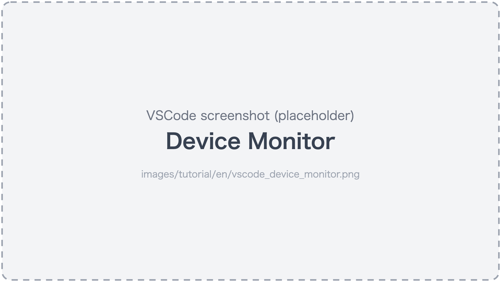
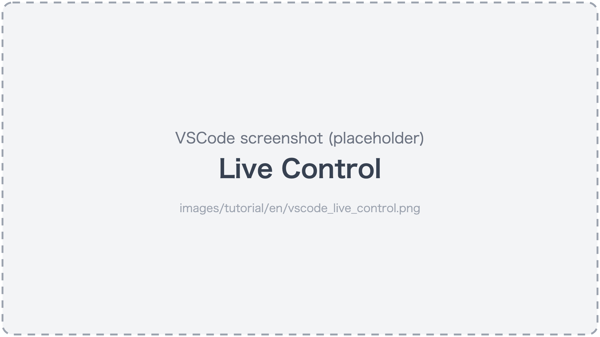
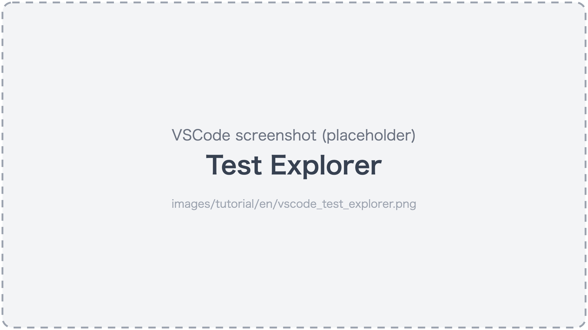
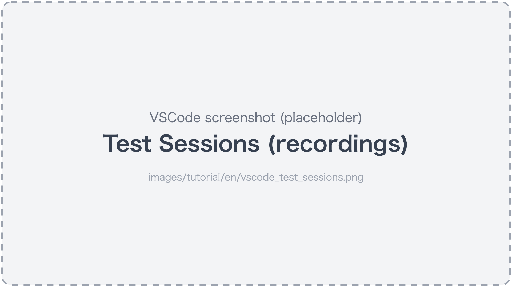
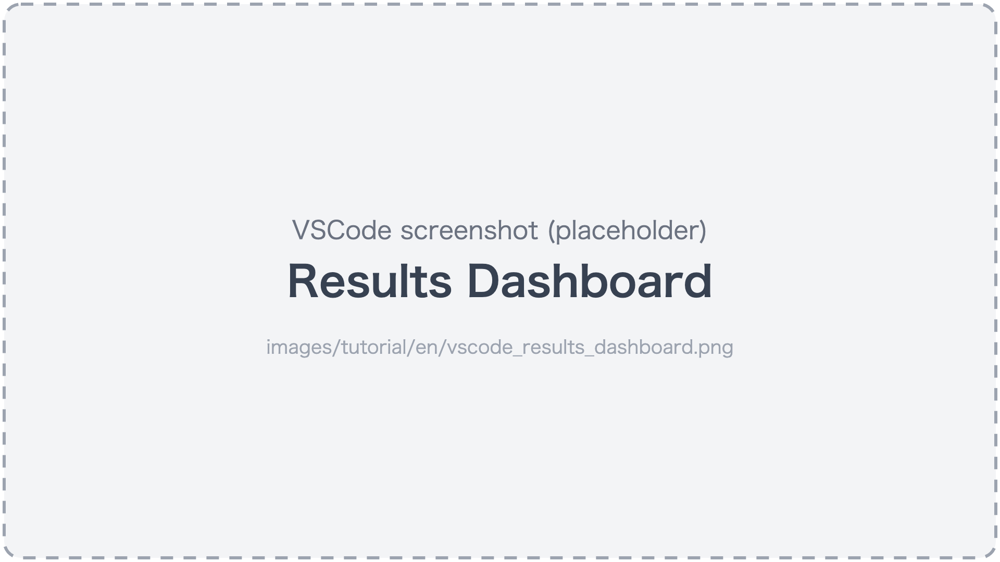

# Watching in VSCode

[in Japanese(日本語)](watching_in_vscode_ja.md)

While the AI assistant creates and runs tests, you can **watch** what is happening in the VSCode extension.
The VSCode extension comes with the installation in [Getting started](../getting-started.md).

## Device Monitor

Run the command "fleetest: Show Device Monitor", or click
**fleetest mobile** in the status bar at the bottom left of VSCode, to open it.

- **The device screens line up in near real time**. You can watch the AI assistant exploring, and tests
  running in parallel on multiple devices, as they happen.
- A device you select by clicking its tile is shown enlarged below, and its execution log (which step is running and whether it passed) streams in.
- The "Running" section at the top shows the runs in progress, with "how many of how many" and "how many minutes left".



### When the Mac is slow

Streaming the screens puts load on the Mac. When you are running many devices in parallel and things get slow,
turn "Live Updates" in the Device Monitor OFF to stop streaming and lower the load (status display continues).

## Touch it yourself (Live Control)

In the "Live Control" tab, you can operate the device screen directly with the mouse (click to tap, drag to swipe).
Use it when you want to check how the screen looks before asking the AI assistant, or to set up by hand the state a test assumes.

You can also turn your operations directly into a scenario with "Start Recording" -> operate -> "Stop Recording".
A scenario made by recording has no verifications in it, so ask the AI assistant to finish it
([Creating tests](creating_tests.md#creating-by-recording-vscode)).



## Test list and runs (Test Explorer)

In VSCode's Testing view, the project's scenarios appear in three levels: folder -> class -> test.

- You can select tests and press "Run" or "Run (dry-run)". Before "Run", choose a run profile with
  `fleetest: Select Run Profile` in the Command Palette (without one, the run does not start).
- Pass/fail is shown right there, and you can open the failure report from it.



## Watching recordings

Recording is on by default, and the "Test Sessions" tab lets you look back at each scenario's video and steps.
If the Device Monitor is showing when a run finishes, it switches to this tab automatically.
You can also export the results to an Excel file.

To save space, you can keep recordings only for failed scenarios.

```text
For fleetest's iOS runs, keep recordings only for failed scenarios.
```



## Results Dashboard

The command "fleetest: Open Results Dashboard" lists the run history, newly failing tests, recovered tests, and
success rate.



## Learn more

See [VSCode extension](../reference/tools/vscode_extension.md) for all features and settings.

Next: [Network exposure and security](../security/network_security.md)

### Link
- [index](../index.md)
