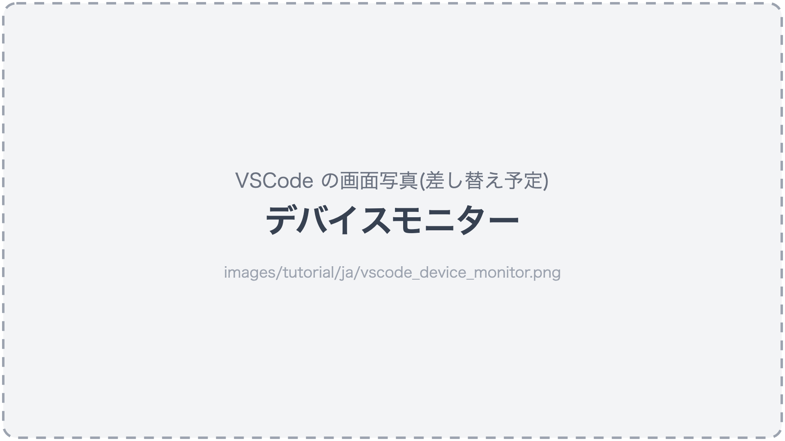
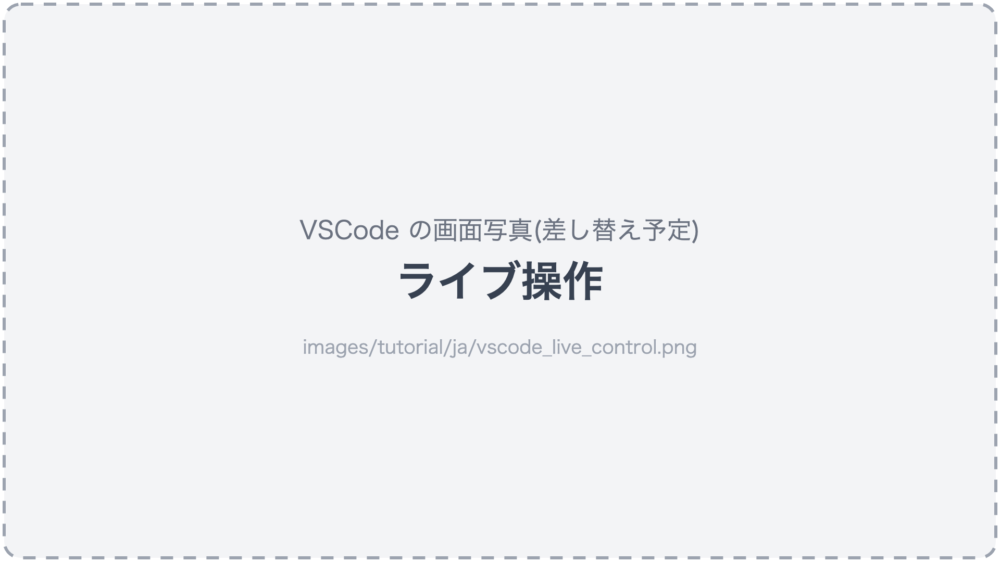
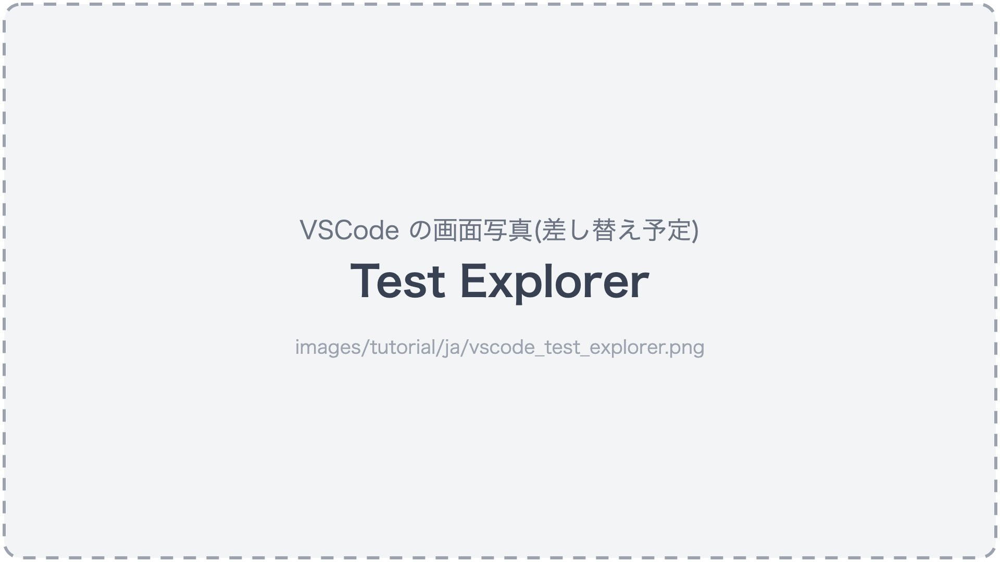
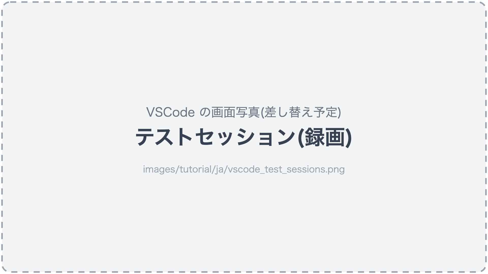
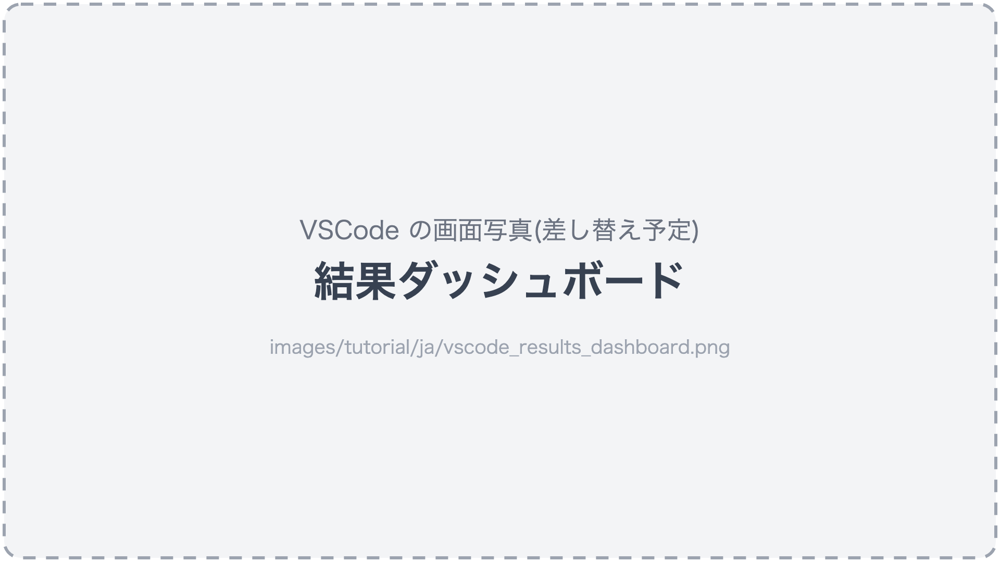

# VSCode で見る

AI アシスタントがテストを作り、実行している間、何が起きているかは VSCode 拡張で**見る**ことができます。
VSCode 拡張は[はじめに](../getting-started_ja.md)のセットアップで入ります。

## デバイスモニター

コマンド「fleetest: デバイスモニターを表示」を実行するか、VSCode 左下のステータスバーの
**fleetest mobile** をクリックすると開きます。

- **デバイスの画面がほぼリアルタイムに並びます**。AI アシスタントが探索している様子や、テストが
  複数のデバイスで並列に走っている様子をそのまま見られます。
- タイルをクリックして選んだデバイスは、下に拡大表示され、その実行ログ(どの手順を実行中か・成否)が流れます。
- 上部の run ボードには、いま走っている実行が「何本中何本」「残り何分」つきで出ます。



### Mac が重いとき

画面の配信は Mac の負荷になります。たくさんのデバイスを並列に動かしていて重いときは、
デバイスモニターの「ライブ更新」を OFF にすると配信が止まり、負荷が下がります(状態の表示は続きます)。

## 自分の手で触る(ライブ操作)

「ライブ操作」タブでは、デバイスの画面をマウスで直接操作できます(クリックでタップ・ドラッグでスワイプ)。
AI アシスタントに頼む前に画面の様子を確かめたいとき、テストの前提になる状態を手で作りたいときに使えます。

「レコーディング開始」→ 操作 →「レコーディング終了」で、操作をそのままシナリオにすることもできます。
録画で作ったシナリオには検証が入らないので、仕上げは AI アシスタントに頼みます
([テストを作る](creating_tests_ja.md#録画して作るvscode))。



## テストの一覧と実行(Test Explorer)

VSCode の Testing ビューに、プロジェクトのシナリオがファイル → クラス → テストの3階層で並びます。

- テストを選んで「実行」「実行 (dry-run)」を押せます。
- 成否がその場で表示され、そこから失敗のレポートを開けます。



## 録画を見る

実行プロファイルで録画を有効にしておくと、「テストセッション」タブでシナリオごとの動画と手順を見返せます。
デバイスモニターを表示したまま実行が終わると、自動でこのタブに切り替わります。
結果を Excel ファイルに書き出すこともできます。

```text
fleetest の ios プロファイルで録画を有効にして。
```



## 結果ダッシュボード

コマンド「fleetest: 結果ダッシュボードを開く」で、実行の履歴・新たに落ちたテスト・回復したテスト・
成功率を一覧できます。



## もっと詳しく

全機能と設定項目は[VSCode 拡張](../reference/tools/vscode_extension_ja.md)を参照してください。

### Link
- [index](../index_ja.md)
